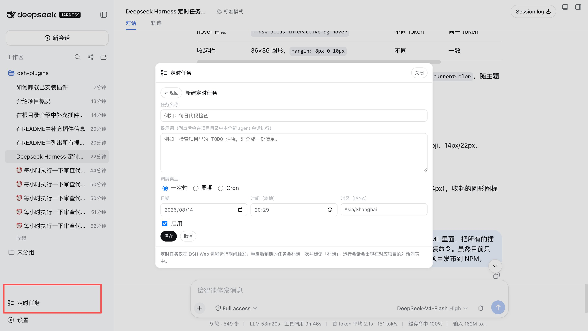

# @opendsh/dsh-plugin-scheduled-tasks

DSH web plugin: **per-project scheduled tasks with prompts**. Create a task in the
sidebar (⏰ 定时任务), give it a prompt, and the plugin runs that prompt on
schedule — as a fresh headless agent session in the project directory — then
records the outcome as durable run history.



## What it does

- **Project-scoped tasks** — each task belongs to a project directory (a DSH
  workspace). The panel lists tasks for the selected workspace.
- **Three schedule kinds**
  - `at` — run once at an absolute time (strict RFC 3339 instant, or a local
    date/time with an explicit IANA time zone; DST gaps are rejected, overlaps
    pick the earlier instant).
  - `every` — run on a fixed creation-anchored interval (≥ 5 minutes); missed
    intervals are never replayed, only the latest due occurrence runs.
  - `cron` — run on a cron calendar rule (five/six/seven-field expression, e.g.
    `0 9 * * 1-5`, evaluated in an explicit IANA time zone, DST-aware).
- **Prompt execution** — on schedule, a brand-new agent session is created in
  the project directory with the task's prompt and driven to quiescence (the
  same drive pattern as `dsh --profile headless`). The run session appears
  in the project's conversation list with a pinned title (`⏰ <task name>`) and
  stays resumable; the final assistant text is also captured into the run record.
- **Run history** — status (`running` / `completed` / `failed`), start/finish
  times, output (truncated at 20 KB), error messages; newest first, capped at
  20 records per task (configurable).
- **Manual run-now** — runs a task immediately without touching its schedule.
- **Lifecycle semantics**
  - Runs only while the DSH web process is alive. After a restart, overdue
    one-shots run once and are marked `overdue`; overdue `every` tasks run only
    their latest due occurrence.
  - One-shot `at` tasks finish after their single run; `every` tasks stay
    active and advance to the next anchor-aligned target.

## Architecture

A dual-face npm package installed into the `web` profile:

| Half     | Entry           | Role                                                                                                                                                                                                                          |
| -------- | --------------- | ----------------------------------------------------------------------------------------------------------------------------------------------------------------------------------------------------------------------------- |
| Server   | `lib/index.js`  | Cordis plugin: opens the `scheduled_tasks` storage domain (`ctx.storageDomain`), mounts the task store, the scheduler (bounded timers, clock-rollback-safe wakes), the headless executor, and the `ctx.tasks` typert service. |
| Protocol | `lib/typert.js` | Host TYPERT face (`tasks/*` endpoints), auto-registered by `dsh-typert-loader`.                                                                                                                                               |
| Browser  | `lib/client.js` | React panel mounted into the `sidebar.footer.action` slot; calls the host through the installed `remote.tasks` namespace.                                                                                                     |

The client↔server channel is the DSH typert protocol (the same mechanism
`dsh-commands` uses): strict zod codecs validate every argument and result on
both sides, and no session needs to exist for the panel to work.

## Install

```sh
dsh plugin --profile web add @opendsh/dsh-plugin-scheduled-tasks
```

## Development

```sh
pnpm --dir src/plugins/dsh-plugin-scheduled-tasks typecheck   # tsc (TypeScript 7)
pnpm --dir src/plugins/dsh-plugin-scheduled-tasks test        # vitest
pnpm --dir src/plugins/dsh-plugin-scheduled-tasks build       # tsc emit + tsdown client bundle + loader wrapper
```

After changing sources, rebuild and re-sync the profile copy
(`pnpm install` inside the profile re-copies `file:` dependencies), then
restart `dsh web` — the plugin has no HMR channel.

## Configuration

| Key                 | Default | Meaning                                                               |
| ------------------- | ------- | --------------------------------------------------------------------- |
| `maxConcurrentRuns` | `2`     | Maximum concurrently running agent sessions across all tasks.         |
| `keepRunsPerTask`   | `20`    | Run-history records retained per task (oldest pruned beyond the cap). |

## Limitations

- Schedules fire only while the web process is running (same posture as
  `dsh-schedule`); there is no external wake-up when the process is down.
- Each run consumes model tokens with the current default model — the panel
  says so explicitly.
- Run history is refreshed by polling while the panel is open (10 s interval);
  push updates are deferred work.
