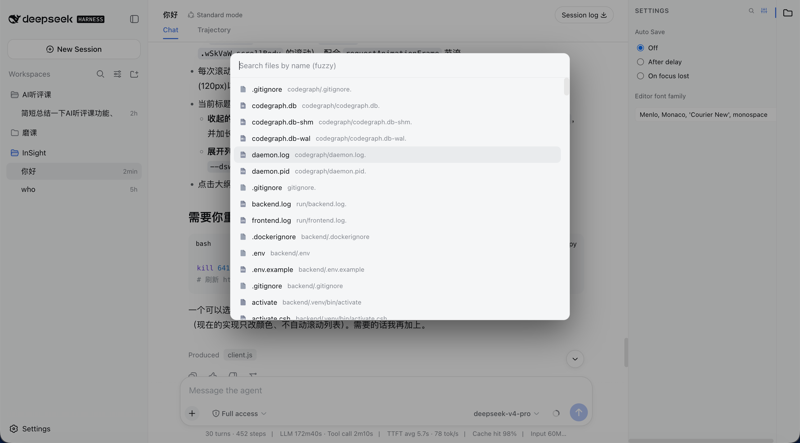
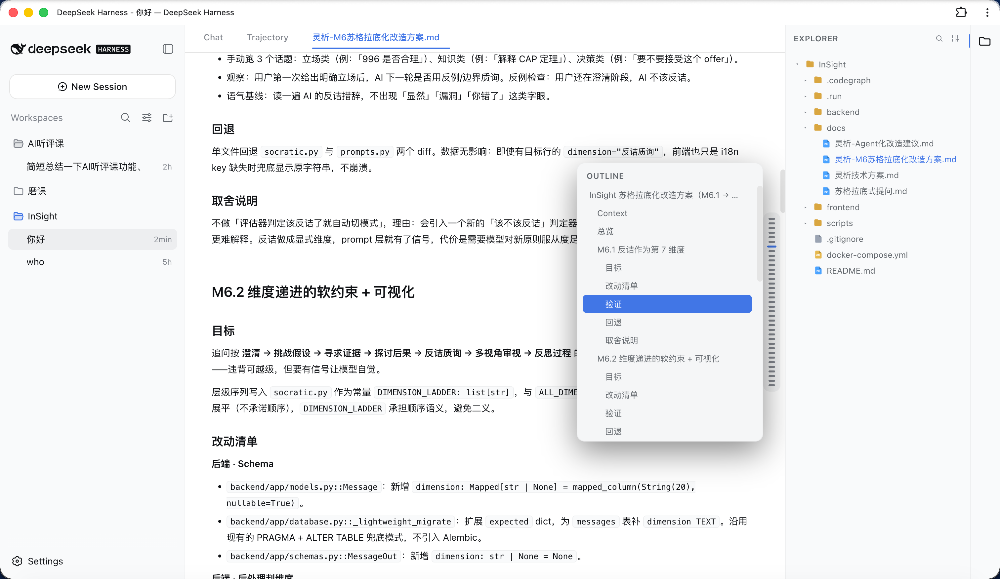
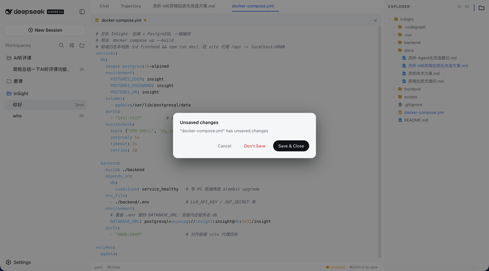

# dsh-plugin-file-explorer

English | [中文](README.zh.md)

A VS Code-style workspace file explorer for the [DeepSeek Harness (DSH)](https://www.deepseek.com) web UI: right-side file tree + editable tabs + Markdown read/edit/split + floating outline + Quick Open.

## Features

- **File tree**: right-side explorer with type-colored icons and collapsible folders; click a file to open it in the center area.
- **Editable tabs**: center tabs (after the conversation/trace tabs) with syntax highlighting, Tab indent, `⌘/Ctrl+S` save, hover `×` close, and a right-click menu (Close / Close Others / Close to the Right / Close Saved / Close All / Copy Path / Pin).
- **Auto-save**: configurable "Off / After delay / On focus lost"; a confirm dialog guards closing unsaved files.
- **Markdown**: Typora/Obsidian-style "Read / Edit / Split" modes; a floating outline on the right in read mode that expands on hover (like ChatGPT's hover bar).
- **Quick Open**: `⌘/Ctrl+P` fuzzy file search and open (same as VS Code); also reachable via the magnifier button in the sidebar header.
- **i18n**: switches between Chinese and English by following the DSH general setting.
- **Editor font**: customize the editor font for opened files in the settings panel (monospace contexts).

## Screenshots

**Explorer expanded**


**Explorer collapsed**


**File settings**


**File search**



**Open file**


**Markdown outline**



**Closing an unsaved file**



## Installation

> Requires DSH with an initialized `web` profile (auto-created on first `dsh web`).

### Option 1: install from npm

```bash
# 1) install into the web profile (equivalent to running `pnpm add` in that profile)
dsh plugin --profile web add dsh-plugin-file-explorer
```

### Option 2: install from GitHub (no npm publish required)

```bash
dsh plugin --profile web add github:bearllfleed/dsh-plugin-file-explorer
```

### Then enable the plugin

Installing only adds the package as a dependency; you must also register it in the profile's `cordis.patch.yml` so DSH loads it. Edit `$DSH_HOME/profiles/web/cordis.patch.yml` and add:

```yaml
- insert:
    - id: file-explorer
      name: 'dsh-plugin-file-explorer'
```

`id` is a unique identifier in the config tree (customizable); `name` must be the npm package name.

### Restart

```bash
dsh web
# then refresh http://127.0.0.1:3080
```

## Usage

| Action | Shortcut / entry |
|---|---|
| Toggle file tree | file icon in the right activity bar |
| Open a file | click in the tree; or `⌘/Ctrl+P` then Enter |
| Save | `⌘/Ctrl+S` |
| Close a tab | hover `×` on the tab, or right-click menu |
| Markdown mode | "Read / Edit / Split" at the top of the file |
| Markdown outline | hover the right floating bar in read mode |
| Editor font / auto-save | gear button in the sidebar header |

## Layout

```
lib/index.js    host (Node) routes: list / read / raw / write / files
lib/client.js   browser bundle: tree, editor, Markdown, outline, Quick Open
package.json    plugin manifest (dsh.client.inject / platform)
```

## Development

After editing `lib/`, if the plugin is installed via a `file:` link, sync to `$DSH_HOME/profiles/web/node_modules/dsh-plugin-file-explorer/lib/`; otherwise re-run `dsh plugin add` and restart.

## License

[MIT](LICENSE)
