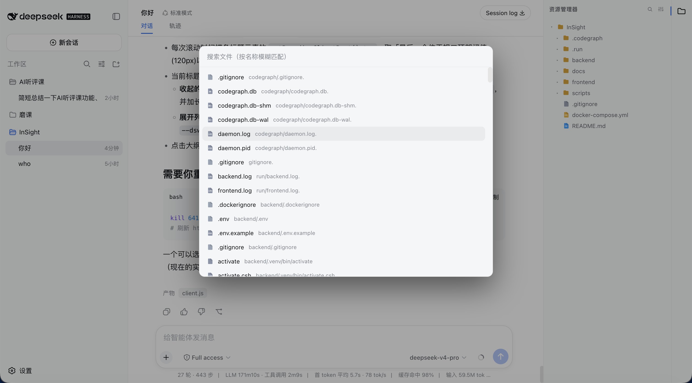
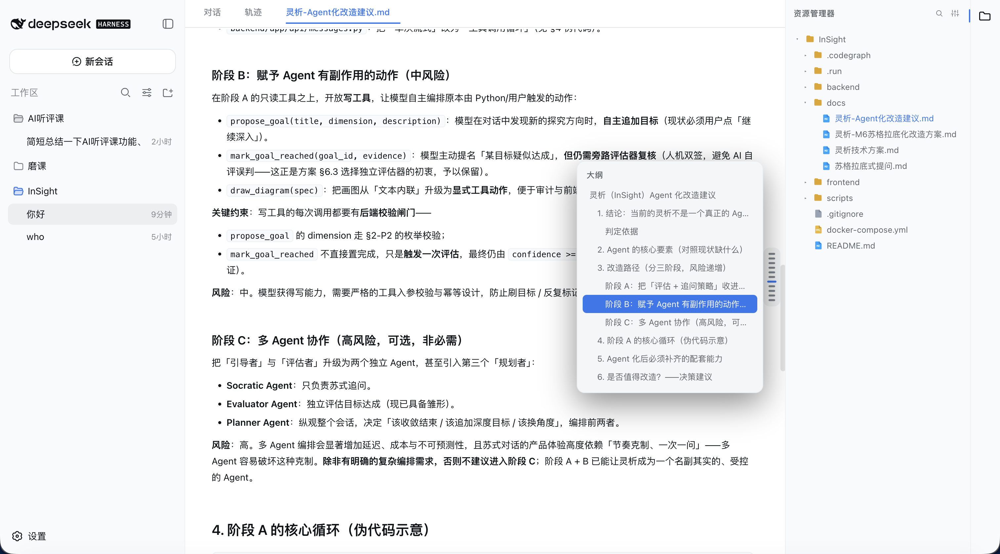

# dsh-plugin-file-explorer

[English](README.md) | 中文

给 [DeepSeek Harness (DSH)](https://www.deepseek.com) Web 界面加一个 VS Code 风格的工作区文件浏览器：右侧文件树 + 可编辑标签页 + Markdown 阅读/编辑/分屏 + 悬浮大纲 + Quick Open 搜索。

## 功能

- **文件树**：右侧资源管理器，按类型着色图标，可折叠目录，点击在中心区打开文件。
- **可编辑标签页**：中心区标签页（位于「对话 / 轨迹」之后），支持语法高亮、Tab 缩进、`⌘/Ctrl+S` 保存、悬停 `×` 关闭、右键菜单（关闭 / 关闭其他 / 关闭右侧 / 关闭已保存 / 全部关闭 / 复制路径 / 固定）。
- **自动保存**：可配置「关闭 / 延迟保存 / 失焦保存」，关闭未保存文件时弹确认框。
- **Markdown**：Typora/Obsidian 式「阅读 / 编辑 / 分屏」三模式；阅读模式右侧悬浮大纲，鼠标悬停展开（类似 ChatGPT 悬浮条）。
- **Quick Open**：`⌘/Ctrl+P` 按文件名模糊搜索并打开文件（与 VS Code 一致），也可点侧栏放大镜按钮进入。
- **多语言**：跟随 DSH 通用设置自动切换中文 / 英文。
- **编辑器字体**：设置面板可自定义打开文件的编辑器字体（等宽上下文）。

## 效果

**资源管理器展开效果**


**资源管理器收起效果**


**文件设置**


**文件搜索**



**打开文件**


**markdown大纲**



**关闭未保存文件**


## 安装

> 需要已安装 DSH 并初始化过 `web` profile（首次运行 `dsh web` 会自动生成）。

### 方式一：从 npm 安装

```bash
# 1) 安装到 web profile（等价于在该 profile 目录执行 pnpm add）
dsh plugin --profile web add dsh-plugin-file-explorer
```

### 方式二：从 GitHub 安装（无需发布 npm）

```bash
dsh plugin --profile web add github:bearllfleed/dsh-plugin-file-explorer
```

### 然后启用插件

安装只把包放进依赖，还需要在 profile 的 `cordis.patch.yml` 里登记，DSH 才会加载它。编辑
`$DSH_HOME/profiles/web/cordis.patch.yml`，加入：

```yaml
- insert:
    - id: file-explorer
      name: 'dsh-plugin-file-explorer'
```

`id` 是配置树中的唯一标识（可自定义），`name` 必须是 npm 包名。

### 重启

```bash
dsh web
# 然后刷新 http://127.0.0.1:3080
```

## 使用

| 操作 | 快捷键 / 入口 |
|---|---|
| 打开 / 关闭文件树 | 右侧活动栏文件图标 |
| 打开文件 | 文件树点击；或 `⌘/Ctrl+P` 搜索后回车 |
| 保存 | `⌘/Ctrl+S` |
| 关闭标签页 | 标签页悬停 `×`，或右键菜单 |
| Markdown 模式 | 文件顶部「阅读 / 编辑 / 分屏」 |
| Markdown 大纲 | 阅读模式右侧悬浮条，悬停展开 |
| 编辑器字体 / 自动保存 | 侧栏齿轮设置按钮 |

## 目录结构

```
lib/index.js    宿主侧（Node）路由：list / read / raw / write / files
lib/client.js   浏览器侧 bundle：文件树、编辑器、Markdown、大纲、Quick Open
package.json    插件清单（dsh.client.inject / platform）
```

## 开发

改完 `lib/` 后，若插件通过 `file:` 链接安装，直接同步到
`$DSH_HOME/profiles/web/node_modules/dsh-plugin-file-explorer/lib/` 即可；否则重新 `dsh plugin add` 并重启。

## License

[MIT](LICENSE)
