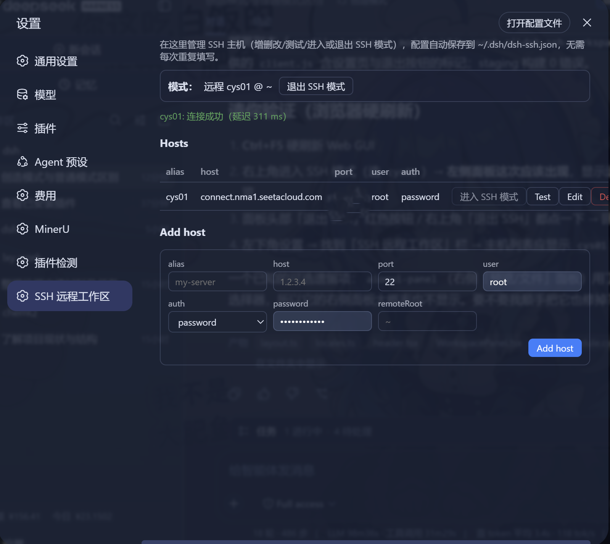
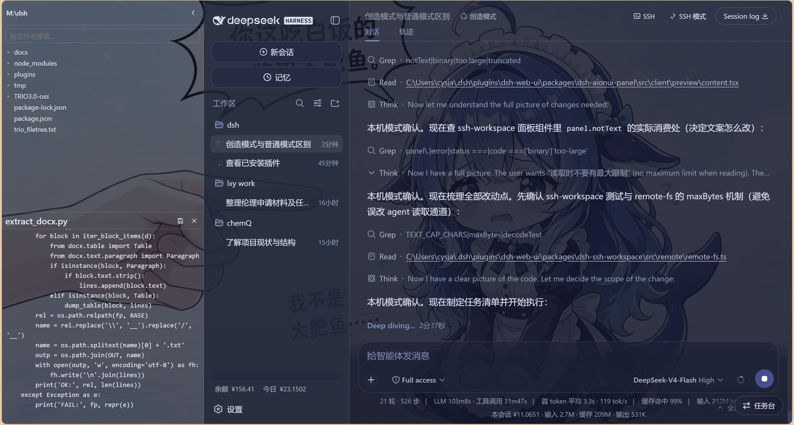
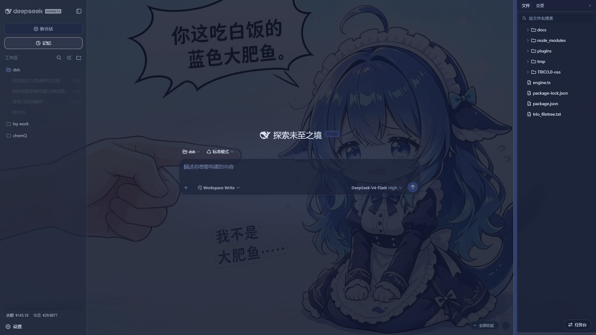
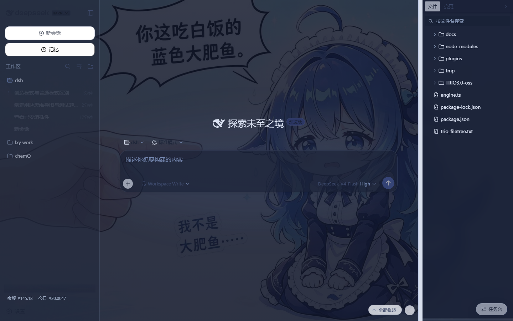

# dsh-easyssh — DSH 远程 SSH 工作区插件

<p align="center">
  
  
  
</p>

在 DeepSeek Harness（DSH）Web GUI 里一键进入 **SSH 远程工作区模式**：右上角（session log 左侧）配置
SSH 主机（密码 / 密钥，复用 `~/.dsh/dsh-ssh.json`），进入后右侧面板（aionui-panel）的文件树自动切换
到远程服务器（上下分栏：上=文件树，下=可编辑代码区），**模型本机的
read / write / edit / glob / grep 与 bash / 终端在 SSH 模式下透明地在远程服务器执行**，LLM 与 Agent
循环仍在本机——「本地大脑、远程手脚」。右上角一键切回本机。

## 特性

- **接缝切换**：通过 profile 补丁把 `ctx.fs` / `ctx.subprocess` 切换为模式路由门面——本地模式委托
  给部署自带的沙箱化实现，SSH 模式委托给 SFTP/SSH 远程实现（原子写、版本校验、CRLF 处理、流式输出、
  PTY 终端）。模型工具零改动地远程执行。
- **远程文件系统**：完整 `@deepseek-ai/dsh-fs` 实现，路径/版本/原子写/CRLF/规范路径传输。
- **远程子进程**：完整 `@deepseek-ai/dsh-subprocess` 实现，exec + PTY 终端，输出溢出转储到本地。
- **Web GUI 前端（JupyterLab 风格工作区）**：右上角 SSH 配置/切换按钮；右侧面板随 SSH 模式自动切换
  数据源——本地显示会话工作目录、SSH 模式显示远程目录（上=文件树，下=可编辑代码区，保存带 mtime
  冲突检测）。
- **代码区布局切换**：预览可在「下框展示」与「右侧弹出代码框」之间一键切换（⇊ / ⇉）；右弹模式下每行
  代码底色交替（Trae 风格）+ 行号，可读写编辑。
- **运行与终端**：代码工具栏「▶ 运行」直接执行当前文件（python/node/bash 等，SSH 模式下在远程执行）；
  「>_ 终端」打开命令行面板，可随时输入命令；文件栏 tab 条也有独立终端入口（不打开代码也能用）。
- **文件右键菜单**：下载 / 重命名 / 复制 / 粘贴 / 删除，本地与远程一致。
- **符号链接跟随**：远程文件树正确识别符号链接目录（如 AutoDL 的 `/root/autodl-tmp`）。
- **显式远程工具**：`remote_status` / `remote_ls` / `remote_read` / `remote_write` / `remote_mkdir` /
  `remote_rm` / `remote_rename` / `remote_glob` / `remote_grep`，以及 `ssh_exec` / `ssh_upload` /
  `ssh_download`。
- **多主机**：GUI 配置多台主机（含 ProxyJump 跳板链、密钥 passphrase），一键切换。
- **设置页主机管理**：设置面板内置「SSH 远程工作区」专区，主机增删改 / 测试连接 / 进入退出一键完成，
  配置持久化在 `~/.dsh/dsh-ssh.json`。

## 界面截图



设置面板中的「SSH 远程工作区」专区：管理主机、测试连接、进入 / 退出 SSH 模式。



连接 SSH 后右侧面板显示远程文件树，下方可打开 `.py` 等文本文件查看并编辑保存（mtime 冲突检测）。



DSH Web GUI 主界面（深色主题）：右上角 SSH 配置/切换按钮，右侧文件面板随会话工作目录展示文件树。



右侧上下分栏面板：上=文件树（文件名搜索定位），下=代码预览/编辑区；本地目录、SSH 远程目录自动切换。

### 操作速览

- **布局切换**：预览 tab 条右侧「⇊ / ⇉」按钮——下框展示 vs 右侧弹出代码框（右弹模式每行底色交替 + 行号）。
- **运行代码**：打开 `.py` / `.js` / `.sh` 等文件 → 工具栏「▶ 运行」，SSH 模式下在远程主机执行。
- **打开终端**：预览工具栏「>_ 终端」，或文件栏 tab 条「>_」按钮（不打开代码也能开命令行），可直接输入命令。
- **文件右键**：文件树节点右键 → 下载 / 重命名 / 复制 / 粘贴 / 删除（本地与远程一致）。

## 仓库结构

```
dsh-easyssh/
├── packages/
│   ├── dsh-ssh/        # SSH 引擎：ssh2 连接池、exec/PTY/SFTP/隧道/集群（本插件依赖）
│   └── dsh-easyssh/    # 本插件：模式状态机、接缝门面、远程实现、Web GUI 前端
└── README.md
```

> 右侧文件面板（文件树 / 预览 / 终端 / 右键菜单）由 [dsh-aionui-panel]（DSH Web GUI 右侧面板系统，
> 与 dsh-easyssh 配套使用）提供；dsh-easyssh 通过 `sshWorkspaceMode` 跨插件服务驱动它跟随 SSH 模式。

## 安装

前置要求：Node.js ≥ 22、pnpm、已安装 dsh（`npx @deepseek-ai/dsh`），并已安装配套的 dsh-aionui-panel
（右侧面板系统）。

```sh
# 1) 克隆并构建
git clone https://github.com/chenw2759-wq/dsh-easyssh.git
cd dsh-easyssh
pnpm install
pnpm --filter "./packages/dsh-ssh" build
pnpm --filter "./packages/dsh-easyssh" build

# 2) 把两个包安装到 web profile（注意用你自己的绝对路径）
dsh plugin --profile web add file:C:/你的路径/dsh-easyssh/packages/dsh-ssh
dsh plugin --profile web add file:C:/你的路径/dsh-easyssh/packages/dsh-easyssh
```

### ⚠️ 第 3 步：接缝切换补丁（关键）

打开 `<profile>/cordis.patch.yml`（Windows 默认 `C:\Users\<你>\.dsh\profiles\web\cordis.patch.yml`），写入：

```yaml
- id: fs-sandbox
  disabled: true
- id: subprocess
  disabled: true
- insert:
  - id: easyssh-fs
    name: 'dsh-easyssh/fs'
  - id: easyssh-subprocess
    name: 'dsh-easyssh/subprocess'
```

### 第 4 步：重启

```sh
# 重启 dsh
npx @deepseek-ai/dsh web
```

打开 `http://127.0.0.1:3080` → **Ctrl+F5 硬刷新**（浏览器缓存旧 client 包时必做）→ 右上角 SSH 按钮配置主机 → 进入 SSH 模式。

> 回滚 = 把 `cordis.patch.yml` 恢复为 `[]` 再重启。

## 使用

1. 会话右上角（session log 左侧）点击 **SSH** → 填主机（别名/主机/端口/用户名/密码或密钥/远程根）
   → 保存并测试 → 进入 SSH 模式。
2. 右侧面板自动切换到远程文件树；直接对 Agent 说「读/改远程文件」「在服务器上执行命令」——普通工具即远程执行。
3. 路径规则：远程绝对路径直接用；相对路径以远程根 `remoteRoot`（默认 `~`）为基准；不要用 Windows 本机路径。
4. 右上角切换按钮随时回到本机模式。

## 安全

- 路由仅 loopback（同源校验）；认证材料存 `~/.dsh/dsh-ssh.json`（0600）。
- 远程操作消耗真实远程资源，先确认再执行；**SSH 模式下本机沙箱不对远程执行生效**。
- 远程 grep/glob/realpath 依赖 GNU find/grep/coreutils。

## 致谢

远程 `ctx.fs` / `ctx.subprocess` 实现移植并改编自 [UynajGI/dsh-ssh](https://github.com/UynajGI/dsh-ssh)
（MIT，详见各文件头与 NOTICE），在其基础上补全了 Web GUI 前端与运行时模式切换。

## License

BSD-3-Clause。远程实现的 MIT 版权归 UynajGI/dsh-ssh 原作者（见 NOTICE）。
