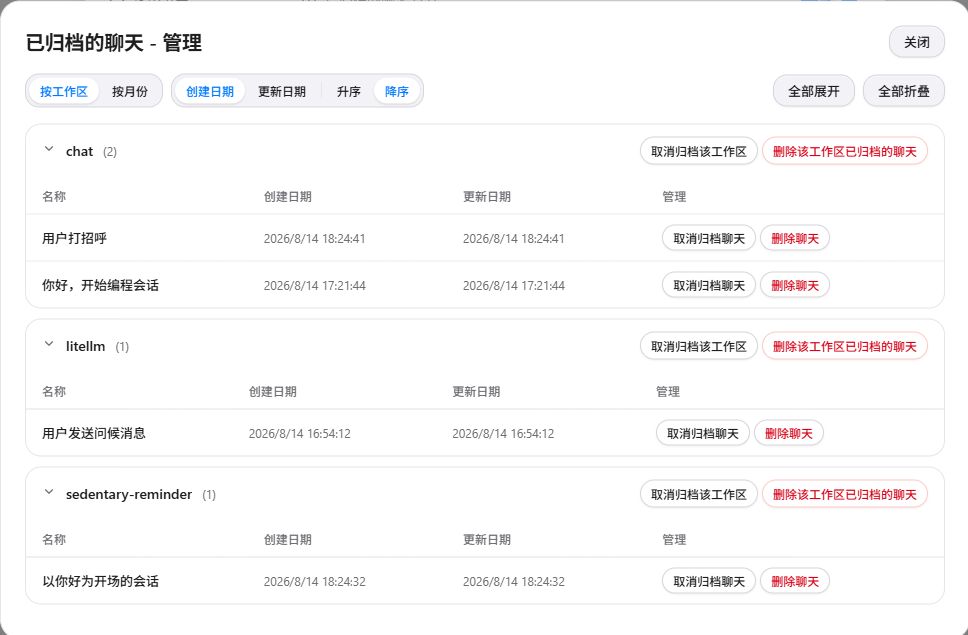

# dsh-session-management · Session Management for DSH

English | [中文](README.md)


dsh-session-management is a session management plugin for DeepSeek Harness (DSH) Web. From the Settings panel you can manage chat sessions in one place: archive, unarchive, **truly delete local chat records**, and export data. The UI follows a restrained Apple/macOS design language and is fully bilingual, switching instantly with the DSH locale setting.



## Features

### Archived chats management

Open the manage dialog and switch between two grouping views:

- **By workspace**: one group per workspace, rows sorted by time;
- **By month**: grouped by year-month (`August 2026`, `July 2026`...), so archives across years are immediately clear.

Sort by created / updated date (ascending / descending), collapse or expand groups at will, and run batch actions per group — unarchive the group, or **delete the archived chats of the group** (only the group's archived sessions are affected; unarchived records are never touched).

| Grouping & sorting | Group-level batch actions |
| --- | --- |
|  |  |

### Archive all chats

Archive every session at once: records stay fully intact, merely hidden from the sidebar list — unarchive them any time from the manage dialog.

### Delete all chats

**Truly delete** local chat records: removes the session log files on disk (`session.jsonl` / `session.jsonl.zstd` and its twin), and cleans up workspace accounting and archive marks. Running sessions are skipped automatically to prevent logs from being rewritten.

### Export data

Reuses the official export endpoint to produce official-format ZIP archives per root session (`dsh-session-<id>.zip`): session log, subagent sessions and media attachments in one package, byte-compatible with the official tooling.

### Bilingual UI

Copy switches instantly with Settings > General > Language; documentation and UI are maintained in both languages.

## Installation

DSH plugins mount through a **profile** (`dsh web` uses the `web` profile). **Restart `dsh web`** after installing.

### Option 1: from npm (recommended)

The plugin is published to npm as `dsh-session-management` — one command:

```sh
dsh plugin --profile web add dsh-session-management
```

After installing, restart `dsh web` and open Settings to find "Session Manager". Upgrade: `dsh plugin --profile web update dsh-session-management`.

> On first install, if `ERR_PNPM_IGNORED_BUILDS` appears (pnpm refuses build scripts), add the reported packages to `allowBuilds` in the profile's `pnpm-workspace.yaml` and re-run.

### Option 2: from GitHub

```sh
git clone https://github.com/cokiscarazo-rgb/dsh-session-management.git
cd dsh-session-management

# Windows (PowerShell)
powershell -ExecutionPolicy Bypass -File scripts/install.ps1

# macOS / Linux
bash scripts/install.sh
```

The installer is idempotent and safe to re-run. It does two things:

1. Copies the package into `$DSH_HOME/profiles/node_modules/dsh-session-management/`;
2. Registers the loader entry in `$DSH_HOME/profiles/web/cordis.patch.yml`:

```yaml
- insert:
    - id: dsh-session-management
      name: dsh-session-management
```

### Verification & uninstall

After installing, restart `dsh web` — the "Session Manager" entry appears in Settings. You can also confirm the plugin layer with `dsh --profile web --dump-config`. If no entry shows up, the usual culprit is a missing restart.

To uninstall, remove `$DSH_HOME/profiles/node_modules/dsh-session-management/`, delete the insert entry from `cordis.patch.yml`, and restart `dsh web`.

## How it works & limitations

- **Archive**: built on the official `workspaceRegistry.archiveSession`; the archive set is persisted in the workspace domain and synced to clients via the official frame mechanism. **Unarchive** is not provided by the official API, so the plugin updates the workspace domain archive set directly; the change is broadcast through the official `domain/changed` event.
- **Delete means delete**: the session log files (including the zstd twin) are located and removed via the system command, then workspace accounting and archive marks are cleaned up; the search index is reconciled automatically by the official SQLite backend.
- **Limitations**:
  - Running sessions are refused for deletion (to avoid logs being rewritten);
  - Image attachments use content-addressed storage and may be shared across sessions, so they are not removed with a session;
  - Subagent sessions are independent records; deleting a parent session does not cascade (they can be deleted individually).

## License

[MIT](LICENSE) © cokiscarazo-rgb
