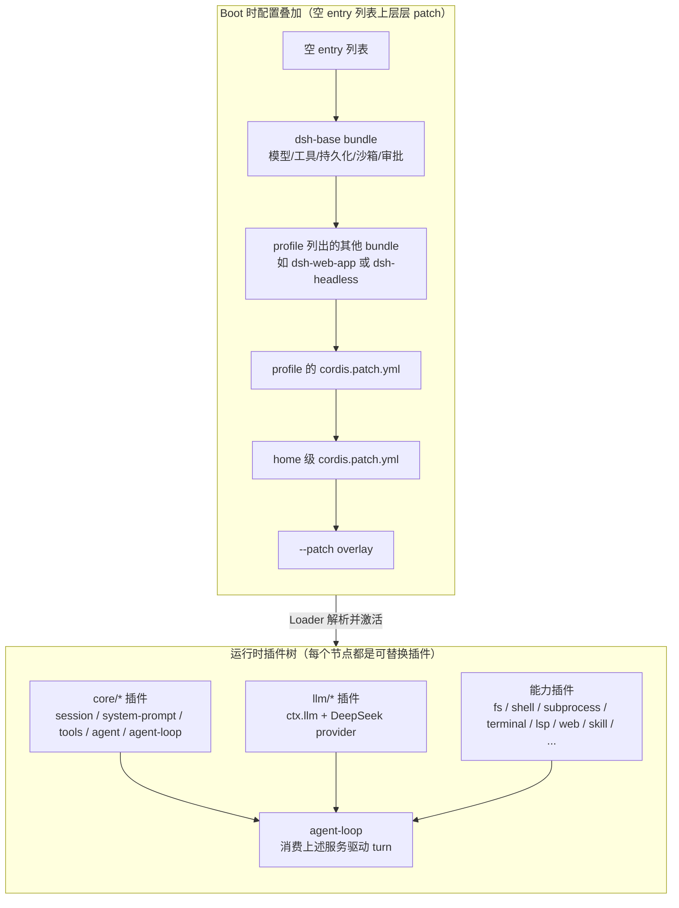

# 架构：Cordis 内核与「Everything is a Plugin」

本页解释 DeepSeek Harness（以下简称 dsh）的内核模型：为什么「一切都是插件」、Cordis 内核负责什么、Service/Consumer 如何协作、事件如何串起插件，以及为什么「通过配置组合、不改源码」是本仓库的设计哲学。

!!! warning "改 `packages/` 前必读"
    仓库根 `AGENTS.md` 第一条即规定：**修改 `packages/` 下任何代码前，必须先阅读上游 `docs/architecture.md`**。本页是其中文导览，但权威仍是上游原文。新增行为应挂在已记录的扩展点上；**修改 `agent-loop` 本身必须同步更新 `docs/architecture.md`**。

## Cordis 是什么

[Cordis](https://github.com/cordiverse/cordis) 是 dsh 内核之下的插件框架，其设计思想来自论文 _A Programming Paradigm for Spatiotemporal Composability_（时空可组合性的编程范式）。dsh 以 **vendored（源码内嵌）** 的方式持有 Cordis 及其基础库（cosmokit、schemastery、loader、include、group、timer、hmr、logger-console），全部 rescope 到 `@deepseek-ai/` scope 下：

| vendored 目录 | npm 名 | 上游名 | 上游版本 |
|---|---|---|---|
| `vendor/cordis/` | `@deepseek-ai/cordis` | `cordis` | 4.0.0-rc.7 |
| `vendor/loader/` | `@deepseek-ai/cordis-plugin-loader` | `@cordisjs/plugin-loader` | 1.0.0-rc.5 |
| `vendor/cosmokit/` | `@deepseek-ai/cosmokit` | `cosmokit` | 1.8.1 |
| `vendor/schemastery/` | `@deepseek-ai/schemastery` | `schemastery` | 3.18.0 |

完整清单与本地修改日志见 `vendor/README.md`。dsh 之所以内嵌而非 npm 依赖，是为了**完全拥有框架层**（可审计、可补丁、可 pin）；每个 harness 包都把 `@deepseek-ai/cordis` 声明为 peerDependency，发布时一并发布该框架层。

Cordis 的五个核心想法（来自 `docs/cordis-primer.md`）：

1. **插件是实现 `Service` 的对象**——可以是带 `inject` / `apply(ctx)` 的函数插件，也可以是 `Service` 子类，Cordis 把它的生命周期挂载进当前 Context。
2. **Context 是服务仓库**——服务通过稳定的 `ctx.<key>`（如 `ctx.tools`、`ctx.llm`、`ctx.sessions`）对外暴露，其他插件按键查找而非导入具体实现。
3. **用 `inject` 声明服务依赖**——插件命名所需服务后会等待它们就绪，加载顺序由服务需求表达，而非手工引导序列。
4. **类型化事件通信**——服务通过 TypeScript declaration merging 声明事件名，再按语义选择 `emit` / `waterfall` / `parallel` / `serial` 派发。
5. **注册是可逆 effect**——prompt 片段、工具 schema、adapter、provider、listener 都通过 `ctx.effect()` 或 `ctx.on()` 安装，重载与卸载时可预测地回退。

## 内核职责：挂载、卸载、依赖管理

Cordis 内核（vendored `cordis/` + `loader/`）承担三件事，dsh 不重写、只在它之上挂插件：

- **插件挂载（mount）**：Loader 从配置树（`cordis.yml` / profile / bundle / patch）读取 entry，按依赖顺序激活每个插件，把它的 `Service` 实例或函数命名空间注册到 Context。
- **插件卸载（unload）**：注册即 effect——`ctx.effect()` 返回 disposer，`ctx.on()` 返回取消订阅；插件卸载时这些 effect 按「后注册先回退」的顺序 unwind。`packages/AGENTS.md` 要求每个 registry 贡献都要通过 HMR-safety 测试证明可被 dispose。
- **依赖管理**：插件通过 `inject` 声明所需服务；Loader 在声明注入激活后才解析配置、运行 `apply`。`docs/architecture.md` 强调「没有特权核心可 patch」——扩展 dsh 就是在其他插件旁边挂一个新插件。

!!! note "vendored 本地加固"
    `vendor/README.md` 记录了 18 条本地修改，其中 `cordis/src/fiber.ts` 生命周期加固关闭了三处重入销毁缺口（effect 注册在 setup 前、UNLOADING 期间拒绝新 effect、子 fiber 在 `internal/plugin` 公告前注册 disposer）。这些加固是 dsh 在 Cordis 之上做的安全垫片，修改 `vendor/*/src/` 必须同步更新该日志。

## Service / Consumer 模型

dsh 把每个可替换能力组织成一个 **capability seam（能力缝）**，包含三个角色——单一角色不构成 seam：

| 角色 | 职责 | 示例 |
|---|---|---|
| **Service Definition（服务定义）** | 声明接口与 `ctx.<key>`，是唯一的「契约面」 | `dsh-fs` 的 `ctx.fs`、`dsh-llm` 的 `ctx.llm` |
| **Service Provider（服务提供方）** | 实现接口的具体后端 | `dsh-fs-local`、`dsh-llm-deepseek` |
| **Consumer（消费方）** | 使用服务的能力，通常是模型可见的工具 | `dsh-tool-fs`、`dsh-tool-web` |

`docs/architecture.md` 用一句话点出 seam 的威力：**换一个 provider 就改了整个产品**。filesystem 与 subprocess provider 共享同一个执行世界，所以把它们指向远程沙箱，Bash、PTY、LSP 会一起跟着迁移，不需要 provider 分叉。subagent provider 同理——从一个全新子 agent 到委派给另一个产品的一次 turn，都藏在同一个接口背后。

`packages/README.md` 补充了一条关键约束：**扩展插件依赖 Service Definition，永不依赖具体 provider**。`dsh-agent-loop` 是可替换的；UI、hook、tool 插件使用 `dsh-agent`。组合 bundle（含 `dsh-agent-spine-demo`）才可以依赖 spine 插件。

## 事件机制：让插件协作

事件是 dsh 的扩展点。`docs/architecture.md` 把事件分成三个域，**挑对域是大多数改动的第一个决策**：

- **Session 事件**（如 `session/event`、`user/message`、`assistant/*`、`tool/*`、`turn/*`、`step/*`）：追加到日志的**持久事实**，必须能在 reload 后存活。新模型可见输入必须扩 `SessionEventMap` 并从日志渲染。
- **Agent 事件**（`agent/*`）：携带**活的** `Agent` 实例——inbox、step、status、request、validation、continuation。用于观察或拦截在途工作。
- **Capability 事件**（`fs/*`、`tools/*`、`telemetry/*` 等）：把策略与 adapter 挂到 seam 上，**无需导入 loop**。

Cordis 的四种派发模式（来自 `docs/cordis-primer.md`），模式是事件公共契约的一部分，新事件用 `@mode` JSDoc 标注：

| 模式 | 是否 await | 派发顺序 | 是否有返回值 |
|---|---|---|---|
| `emit` | 否 | 按注册顺序观察 | 否 |
| `waterfall` | 否 | 按注册顺序观察 | 是 |
| `parallel` | 是 | 所有 listener 并行观察 | 否 |
| `serial` | 是 | 按注册顺序观察 | 是 |

!!! warning "Waterfall 必须调用 `next()`"
    `ctx.waterfall` 是 around-middleware，listener 收到 `(...args, next)`。**必须调用 `next()` 把（可能被改写的）结果委托给下一个服务**；不调 `next()` 直接 return 就是短路。对于单决策事件，短路是设计本身（策略 listener 拥有决策权时可短路；只观察或注解的 listener 必须委托）。

dsh 的 turn 流程串起了这些事件（节选自 `docs/architecture.md`，`turn/*`、`step/*`、`user/message`、`assistant/*`、`tool/*` 是持久 session 事件，其余是活的扩展点）：

```text
turn/start
  claim next-step input + 1 queued message
  assemble prompt sections + tool schemas
  -> agent/pre-step                   reject | enter(messages)
     step/start
     append entered messages as user/message
     derive model history from log
     agent/request -> llm/stream -> assistant/chunk* -> assistant/message
     tool/call* -> tools/pre-execute -> tools/execute -> tools/post-execute -> tool/result*
     step/end
  -> agent/turn-stopping
turn/end
```

`agent/pre-step`、`agent/request`、`llm/stream` 与三个 `tools/*` 事件是 waterfall；`agent/turn-stopping` 是 serial 且没有 `next()`。

## 设计哲学：通过配置组合，不改源码

`docs/architecture.md` 开篇即说：「产品每一部分都是插件——模型 adapter、工具注册表、session 日志、agent loop 本身——因此每一部分都能从配置替换」。这条哲学落在四个机制上：

1. **Profile（配置档）**：Harness home 中命名的组合，列出它堆叠的 bundle、持有的 out-of-tree 插件、用户自己的 `cordis.patch.yml`。`web` 与 `headless` 作为模板随仓库发布。
2. **Bundle（捆绑包）**：Cordis 配置行 + 它们挂载的代码的分发格式，因此 bundle 插入的任何东西都可被上层 patch。`dsh-base` 是每个 profile 的第一层（模型 adapter、工具、持久化、沙箱、审批策略、settings、credentials、telemetry）；`dsh-web-app` 加浏览器应用；`dsh-headless` 加无服务器的一次性 runner。
3. **Patch 叠加顺序**：layers 作用于一个空 entry 列表，顺序是——profile 列出的 bundle → profile 的 `cordis.patch.yml` → home 级 `cordis.patch.yml` → 任何 `--patch` overlay。patch 按 id 定位某行并替换其整段 config，或插入新行。
4. **`dsh --dump-config`**：打印你机器实际 boot 的插件树，任何一行都可被你自己的 patch 替换。



「不改源码」还体现在一条硬规则上：**新行为挂在已记录的扩展点上，而不是改 loop**。`docs/architecture.md` 末尾的「Where new behavior goes」表把常见目标映射到机制——加模型 provider 就 `ctx.llm` 注册 adapter；加模型可见能力就 `ctx.tools` 注册；拦截请求/工具/turn 就用对应的 `agent/*` 或 `tools/*` 事件；加模型可见 context 就 `agent.inject()`；加 UI 就驱动 `ctx.agents` 并从 `session/event` 渲染。

## 插件如何组合成 agent

下图基于 `docs/architecture.md` 的「Core packages」表与 turn 流程，展示一个 agent turn 中各插件如何通过服务与事件协作。core 包提供 spine，能力 seam 提供 provider 与 consumer，事件把 loop、tools、llm 串成一次 step。

```mermaid
sequenceDiagram
    participant Loop as core/agent-loop
    participant Agent as core/agent (ctx.agents)
    participant Session as core/session (ctx.sessions)
    participant Prompt as core/system-prompt (ctx.systemPrompt)
    participant Tools as core/tools (ctx.tools)
    participant LLM as llm/llm (ctx.llm)
    participant Prov as 能力 provider (fs/shell/web/...)
    participant Consumer as 模型可见 tool consumer

    Loop->>Agent: agent/pre-step (waterfall)
    Agent->>Session: claim next-step input
    Agent->>Prompt: assemble prompt sections + tool schemas
    Prompt->>Consumer: 收集 tool schema
    Loop->>Session: append user/message (持久)
    Loop->>Session: deriveMessages() 从日志投影历史
    Loop->>LLM: agent/request (waterfall) -> llm/stream
    LLM-->>Session: assistant/chunk* + assistant/message (持久)
    Loop->>Tools: tool/call* (持久)
    Tools->>Tools: tools/pre-execute (waterfall)
    Tools->>Consumer: tools/execute
    Consumer->>Prov: 调用 ctx.fs / ctx.shell / ctx.web ...
    Prov-->>Consumer: 结果
    Consumer-->>Tools: tool result
    Tools->>Tools: tools/post-execute (waterfall)
    Tools-->>Session: tool/result* (持久)
    Loop->>Agent: step/end
    Loop->>Agent: agent/turn-stopping (serial, 无 next)
    Agent-->>Loop: turn/end
```

core spine 包（来自 `docs/architecture.md` 「Core packages」表）：

| 包 | 拥有 | `ctx` key |
|---|---|---|
| `core/session` | append-only `SessionEvent` 日志与内存 store | `ctx.sessions` |
| `core/system-prompt` | prompt 片段与 tool-schema 装配 | `ctx.systemPrompt` |
| `core/tools` | 作用域工具注册表与受护执行管线 | `ctx.tools` |
| `core/agent` | `Agent` 接口、活注册表、`agent/*` 事件 | `ctx.agents` |
| `core/agent-loop` | 实现该接口的默认驱动 | `ctx.agentLoop` |
| `core/scope` | 每 agent 作用域注册原语 | 库，无 key |
| `llm/llm` | 消息与流词汇 + adapter seam | `ctx.llm` |

## 关键不变量

`AGENTS.md` 的 Conventions 段把这些架构约束固化成可执行的规则，改动前必须知道：

- **Model-visible ⟺ logged**：任何到达模型请求的东西都必须能从 session log 重建；新模型可见输入需要新 session 事件。运行时不变量会断言这一点。
- **`SESSION_FORMAT_VERSION` 保持 0**：pre-release 阶段无兼容承诺；只有结构性格式变更才 bump。`SessionEventMap` 成员默认 read-required，未知类型的 build 拒绝该日志，除非事件带 `ignorable: true`。
- **SQLite 用单调 `SCHEMA_VERSION`**：后端拒绝旧磁盘格式，pre-release 期间可自由重命名/重打包并同步更新引用。
- **Registrations are effects**：每个贡献走 `ctx.effect()` / `ctx.on()`；registry 的 `register()` 返回 disposer。
- **Plugin, not loop change**：新行为上扩展点；改 `agent-loop` 必须更新 `docs/architecture.md`。

## 延伸阅读

- 上游权威：`deepseek-harness/docs/architecture.md`（本页中文导览的源）
- Cordis 入门：`deepseek-harness/docs/cordis-primer.md` 与 `docs/cordis-tutorial/index.md`
- 事件生产者/消费者全表：`deepseek-harness/docs/event-producer-consumer.md`
- 能力 seam 图：`deepseek-harness/docs/capability-seams.md`
- vendored 框架清单与本地修改：`deepseek-harness/vendor/README.md`
- turn 与工具管线细节：`deepseek-harness/docs/agent-lifecycle.md`、`docs/tool-execution-pipeline.md`
