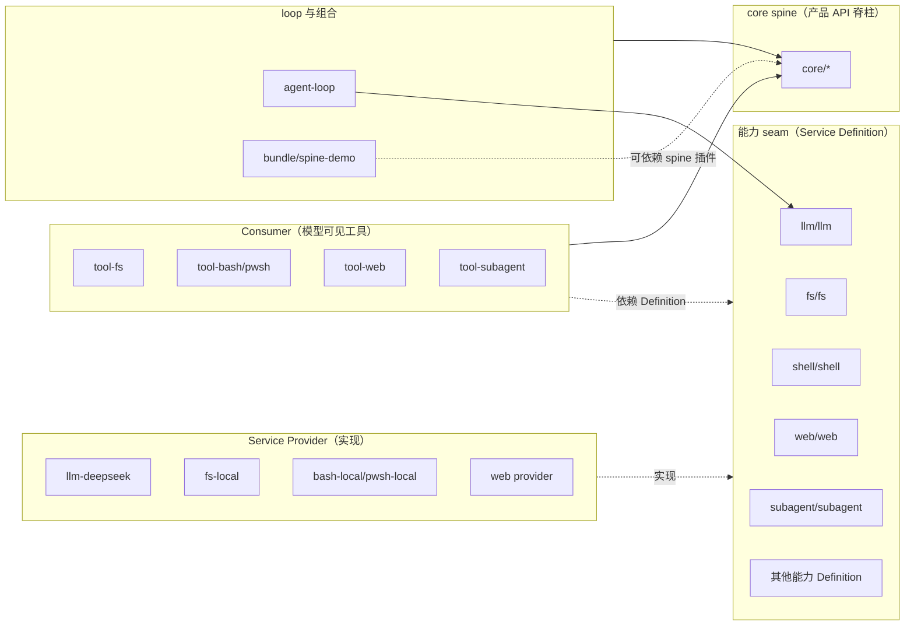

# `packages/` Workspace 布局

本页详解 dsh 仓库的 `packages/` workspace 结构，以及 `python/`、`native/`、`vendor/`、`docs/`、`website/` 等顶层目录。所有分组职责均提取自仓库根 `AGENTS.md` 的「Repository layout」段；当实际目录名与 `AGENTS.md` 描述名不同时，表格「路径」列给出真实目录名并加注。

!!! info "workspace 规则"
    - 所有 npm 包名为 `@deepseek-ai/dsh-<name>`；vendored 包 rescope 到 `@deepseek-ai/` 下（见 `vendor/README.md`）。
    - workspace 路径形如 `packages/<group>/<pkg>/`；分组 README 拥有「包→`ctx` key」映射。
    - `@deepseek-ai/cordis` 是每个 harness 包的 peerDependency（+ dev）。
    - 包分组归属与发布期望见 `packages/README.md`；新包加入已有分组，新分组需更新其 README 与该表。

## `packages/` 分组总表

下表覆盖 `AGENTS.md` 仓库布局中列出的全部分组，职责描述直接来自该文件。

| 分组 | 实际路径 | 职责（提取自 `AGENTS.md`） |
|---|---|---|
| core | `packages/core/` | 产品 API 脊柱：session、system-prompt、tools、agent、agent-loop |
| api | `packages/api/` | 远程 BFF 装配与 Typert RPC 网关 |
| typert | `packages/typert/` | 类型图生成器、加载器与运行时注册表 |
| llm | `packages/llm/` | LLM 能力：Service Definition / Consumer + DeepSeek provider |
| e2b | `packages/e2b/` | E2B POC：sandbox + FS/subprocess adapter |
| shell | `packages/shell/` | bash 能力：Service Definition + local/pwsh provider + shell Consumer |
| subprocess | `packages/subprocess/` | subprocess 能力 + 本地进程树 provider |
| terminal | `packages/terminal/` | 持久化（PTY）会话 |
| fs | `packages/fs/` | 文件系统能力 + 策略 |
| lsp | `packages/lsp/` | language-server 能力 |
| skill | `packages/skill/` | skill provider 注册表 + 本地实现 + catalog/loader 工具 |
| web | `packages/web/` | web 能力：Service Definition + search/fetch provider + tool Consumer |
| compaction | `packages/compaction/` | compaction 能力 + basic provider |
| context | `packages/context/` | request-context 插件 |
| subagent | `packages/subagent/` | subagent 能力：Service Definition + provider + 委派 Consumer |
| bundle | `packages/bundle/` | 可安装的 `dsh --profile` patch-layer bundle |
| workflow | `packages/workflow/` | workflow 能力 + worker-thread provider + tool Consumer |
| todo | `packages/todo/` | `todo_write` 工具 |
| plan | `packages/plan/` | plan mode 作为 logged state |
| preset | `packages/preset/` | 从预设 `cordis.yml` 文件做每会话 agent 组合 |
| guard | `packages/guard/` | loop-hygiene + tool-timeout 插件 |
| self-modification | `packages/extensions/`（实际目录） | agent 检视/挂载自己的插件。`AGENTS.md` 描述名为 `self-modification/`，磁盘实际目录为 `extensions/` |
| hooks | `packages/hooks/` | Claude Code/Codex hook 桥 + wire-protocol 库 |
| session | `packages/session/` | 持久化 session 数据：persistence、projection、titles、telemetry |
| identity | `packages/identity/` | 匿名身份 |
| settings | `packages/settings/` | user-settings 能力 + file provider |
| credentials | `packages/credentials/` | credential-reference 能力 + env/.env provider |
| acp | `packages/acp/` | automation-only Agent Client Protocol 服务器 |
| interaction | `packages/interaction/` | approval/interaction 能力、permission、commands、ask-user |
| boot | `packages/boot/` | 共享 app-bin 引导胶水 |
| sdk | `packages/sdk/` | JSON-RPC 协议、服务器与 TypeScript 客户端 |
| examples | `packages/examples/` | demo bundle（agent-spine + CLI/ACP/JSON-RPC bin） |
| support | `packages/test-support/`（实际目录） | dev/test 基础设施。`AGENTS.md` 描述名为 `support/`，磁盘实际目录为 `test-support/` |
| util | `packages/util/` | 零依赖工具库 |

!!! note "描述名 vs 实际目录名"
    `AGENTS.md` 的仓库布局用 `self-modification/` 与 `support/` 两个描述性名字，但磁盘上的实际目录分别是 `packages/extensions/` 与 `packages/test-support/`。`packages/README.md` 用的是实际目录名。本页在「实际路径」列以磁盘为准。

## `packages/README.md` 补充分组

`packages/README.md` 的分组表比 `AGENTS.md` 仓库布局更细，下面这些分组在 `packages/` 下实际存在，但 `AGENTS.md` 的「Repository layout」段未逐条列出。本节**不编造** `AGENTS.md` 内容，仅引用 `packages/README.md` 的职责描述供定位。

| 实际路径 | 职责（提取自 `packages/README.md`） | 发布期望 |
|---|---|---|
| `packages/attachment/` | 持久化附件身份、校验、本地 content-addressed 存储 | Product — stable API |
| `packages/client/` | Web-GUI 浏览器侧：shell、wire、object service、slot、`ui-*` 插件 | Product — stable API |
| `packages/code-runtime/` | 代码执行能力：Service Definition + worker-thread provider + Code Mode Consumer | Product — stable API |
| `packages/feedback/` | 人类反馈 | Product — stable API |
| `packages/goal/` | 同会话目标持久化与生命周期 | Product — stable API |
| `packages/host/` | Web-GUI host 侧：API 网关 + HTTP 路由服务器 | Product — stable API |
| `packages/jobs/` | 通用后台 job 运行时与模型可见的 `job_*` 控制工具 | Product — stable API |
| `packages/mcp/` | MCP 客户端 | （packages/README 未单列期望） |
| `packages/sandbox/` | 进程约束 seam；bwrap/Landlock/Seatbelt 后端 | Product — stable API |
| `packages/schedule/` | 会话内调度跟进 | Product — stable API |
| `packages/session-query/` | session 检索族：逻辑语料、有界读、lineage、事件关系、语义过滤、SQLite 全文搜索 | Product — stable API |
| `packages/spill/` | spill 能力：存储 seam、本地实现、tool-result spill 策略 | Product — stable API |
| `packages/storage/` | 非 session 存储中心 + 后端 + 领域表单 | Product — stable API |
| `packages/workspace/` | workspace 实体 | Product — stable API |

## 分组依赖关系

`packages/README.md` 与 `docs/architecture.md` 共同约束分组间依赖：

关键依赖规则（来自 `packages/README.md`）：

- **扩展插件依赖 Service Definition，永不依赖具体 provider**。
- `dsh-agent-loop` 可替换；UI、hook、tool 插件使用 `dsh-agent`。
- 组合 bundle（含 `dsh-agent-spine-demo`）可依赖 spine 插件。
- 能力 seam 在三个角色独立演化时才拆分；单角色不构成 seam。
- 依赖图是生成的：`docs/module-graph.md`（`pnpm run gen-module-graph`，CI 有 freshness gate）。

## 顶层目录

`AGENTS.md` 仓库布局在 `packages/` 之外还列出以下顶层目录：

| 路径 | 职责（提取自 `AGENTS.md`） |
|---|---|
| `vendor/` | vendored Cordis 源码——manifest 与 sync 流程见 `vendor/README.md` |
| `packages/` | `@deepseek-ai/dsh-<pkg>` workspace，位于 `packages/<group>/<pkg>/` |
| `python/` | Python SDK 与捆绑运行时（见 `python/README.md`） |
| `native/` | `@deepseek-ai/node-addon-landlock-run` 源码记录（见 `native/README.md`） |
| `examples/` | 可运行的 `cordis.yml` 叶子，叠在 `packages/examples` bundle 之上（见 `examples/AGENTS.md`） |
| `.agents/` | Agent 工作流与 Agent Notes（`notes/`） |
| `docs/` | 架构、生成的 catalog、postmortem、cookbook（见 `docs/AGENTS.md`） |
| `scripts/` | 仓库 gate 与生成器 |
| `website/` | VitePress 投影，选取 `docs/` 双语源（见 `package.json` 的 `workspaces`） |

`package.json` 的 `workspaces` 字段还包含 `apps/*` 与 `native/landlock-run/packages/*`，这两者也是 workspace 成员。

## 包级约定速览

`packages/AGENTS.md` 给出包内规则，改动包时需要遵守（节选）：

- **插件导出形式**：service 包默认导出 service class；函数插件命名导出 `name` / `inject` / `Config` / `apply` 且无默认导出。混用会让 Loader 丢弃函数插件的 namespace。
- **可选服务用 `ctx.get(name)`**：`ctx.<name>` 留给声明的注入；属性代理对拓扑敏感，`ctx.get` 读全局服务 store。
- **产品可见插件需要非单元 REAL-composition 测试**：手工 `ctx.plugin(...)` 套件不足；通过 Loader 与 app/process boot 测试用 `cordis.yml`，只 mock 外部服务或非确定性输入。
- **每个包拥有 `./invariant`**：注册 manifest 名；检查事件/数据关系或给空 installer 写包特定的 `No runtime invariant:` 理由。
- **tsconfig**：extends `tsconfig.base.json`（Client 用 `tsconfig.base.client.json`），`rootDir: src`、`outDir: lib/types`，注册到恰好一个 aggregate。
- **测试位置**：包级 `tests/`，不是 `src/__tests__/`。
- **README 与 JSDoc 随改动更新**：行为变更（config key、默认值、error code、wire field）在同 commit 更新它们。

## 延伸阅读

- 分组归属与发布期望全表：`deepseek-harness/packages/README.md`
- 包级规则：`deepseek-harness/packages/AGENTS.md`
- 生成依赖图：`deepseek-harness/docs/module-graph.md`（`pnpm run gen-module-graph`）
- 添加新包步骤：`deepseek-harness/docs/cookbook/adding-a-package.md`
- 添加 vendored 包步骤：`deepseek-harness/docs/cookbook/adding-a-vendored-package.md`
