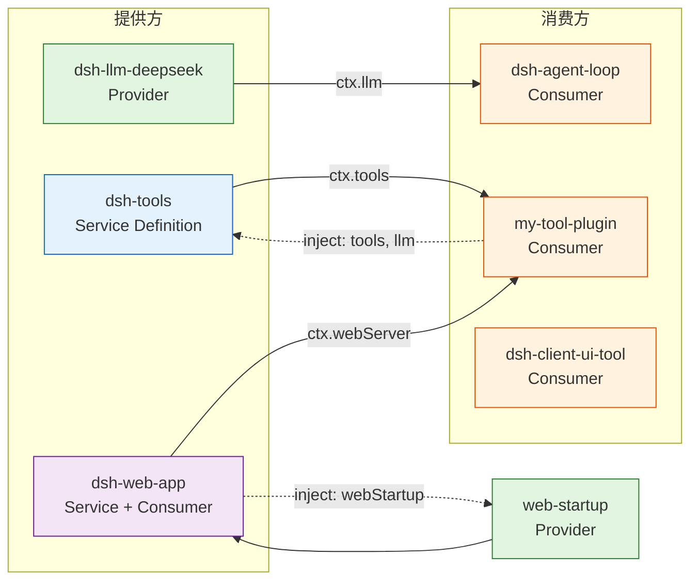

# 插件机制总览

DeepSeek Harness(以下简称 DSH)的核心哲学是 **"Everything is a plugin"**:模型适配、工具、技能、会话、沙箱、存储、调度、UI 等所有能力,全部以插件形式挂载到 vendored Cordis 框架上。`agent-loop` 本身只负责把请求派发给已挂载的工具与服务,新增行为应落在文档化的扩展点上,而不是改动 loop。

## Cordis 插件挂载/卸载/依赖管理

DSH 基于 vendored Cordis(见 `deepseek-harness/vendor/`),插件通过组合树(composition tree)挂载。每个插件是组合树里的一行,由 Loader 激活。

### 挂载

一个插件包导出命名约定:`name`、`inject`、`Config`、`apply`(函数插件)或继承 `Service` 的类(服务插件)。Loader 读取 `cordis.patch.yml` 中的 `insert` 行,按 `name` 解析包,调用 `apply(ctx, config)` 完成挂载。

```ts
// 函数插件四要素
export const name = 'my-plugin'           // 插件标识
export const inject = ['tools']           // 必需 service,未满足时 fiber 保持 pending
export interface Config { enabled: boolean }
export const Config = z.object({ enabled: z.boolean().default(true) })
export function apply(ctx: Context, config: Config): void {
  // 注册工具、监听事件、挂载路由……
}
```

### 卸载

**Registrations are effects**:所有长生命周期资源(路由、监听器、watcher、timer、React root、DOM、socket、临时 service)必须通过 `ctx.effect()` / `ctx.on()` 注册,返回的 disposer 由框架在卸载时调用。disposer 顺序通常是:停止外部入口/注销 registry → 等待或取消在途工作 → 关闭资源。

### 依赖管理

- `inject` 声明**必需 service**;未满足时该插件的 fiber 保持 pending,框架在服务就绪后激活,**不要用轮询模拟依赖注入**。
- `ctx.<name>` 只有在 `inject` 里声明的服务才可用。
- `inject` 只等**服务**(service 已提供),不等 **provider 注册**(同服务下另一行插件的 effect)。任何"依赖兄弟插件行为"的校验必须延迟到首次使用(最早可解析点 fail-loud)。
- 可选 service 用 `ctx.get()` 判断,或用 `ctx.inject([...], childCtx => ...)` 惰性挂载。
- DSH、Cordis、React 等共享运行时优先声明为 `peerDependencies`,避免复制 runtime identity。

## Service / Consumer 模型

一个能力接缝(capability seam)由三个角色组成,完整且不可拆分(只有当角色独立演进时才拆分):

| 角色 | 职责 | 示例 |
|---|---|---|
| **Service Definition** | 声明能力接口与 ctx key | `dsh-llm` 声明 `ctx.llm` |
| **Service Provider** | 实现接口、注册具体后端 | `dsh-llm-deepseek` 注册 DeepSeek 适配器 |
| **Consumer** | 消费能力、面向模型/用户 | `dsh-tool-*` 调用 `ctx.llm` |

Service 插件参考 `packages/host/webserver`:

```ts
import { Service } from '@deepseek-ai/cordis'

export class MyService extends Service {
  static Config = Config
  constructor(ctx: Context, config: Config) {
    super(ctx, 'myService')   // 声明 service key
  }
  async [Service.init](): Promise<void> {
    // 异步启动放在 Service.init,不要放构造器
  }
}
```

- 构造器只声明 service key;异步启动放在 `Service.init`。
- 初始化失败应让 fiber 失败并由启动方报告,不要吞掉组合错误。
- 注册方法返回 disposer;拥有资源的一方负责关闭资源。

Consumer 通过 `inject: ['myService']` 声明依赖,然后在 `apply` 中使用 `ctx.myService`。

## Cordis 事件让插件协作

插件通过事件协作,而非直接互相调用。DSH 的事件系统遵循以下约定:

- **Typed events use declaration merging**:事件类型通过 `declare module` 合并到 `SessionEventMap` 等可扩展映射。
- **Waterfall listeners MUST call `next()`** 委派;返回不调用 `next()` 会短路链。
- **Model-visible ⟺ logged**:任何到达模型请求的内容都必须能从 session log 重建;新的模型可见输入需要对应 session 事件。
- `internal/service` 事件用于服务后绑定场景(如 webServer 服务在插件 apply 后才绑定)。

```ts
// 监听服务注册,做补注册
ctx.on('internal/service', (name) => {
  if (name === 'webServer') {
    // 服务就绪后补注册路由
  }
})
```

## 插件能提供的能力类型

DSH 的能力由不同的 package group 提供,每个能力都是一个 Service/Provider/Consumer 接缝:

| 能力 | ctx key / Service | 说明 | 代表包 |
|---|---|---|---|
| **models (LLM)** | `ctx.llm` | LLM 适配器 | `dsh-llm`, `dsh-llm-deepseek` |
| **tools** | `ctx.tools` | 模型可调用工具 | `dsh-tools`, `dsh-tool-fs`, `dsh-tool-bash` |
| **skills** | `ctx.skills` | 技能注册表与 provider | `dsh-skill`, `dsh-skill-filesystem` |
| **sessions** | `ctx.sessions` / `ctx.agents` | 持久化会话与 Agent | `dsh-session`, `dsh-agent` |
| **sandboxes** | `ctx.sandbox` | 文件效应沙箱 | `dsh-sandbox-local`, `dsh-fs-sandbox` |
| **storage** | `ctx.storage` | 持久化存储 | `dsh-storage`, `dsh-storage-json` |
| **loops** | `ctx.agentLoop` | Agent 循环 | `dsh-agent-loop`, `dsh-workflow-worker-thread` |
| **scheduling (jobs)** | `ctx.jobs` | 后台任务调度 | `dsh-jobs-local`, `dsh-tool-jobs` |
| **shell** | `ctx.bash` / `ctx.shell` | Shell 执行能力 | `dsh-bash-sandbox`, `dsh-pwsh-sandbox` |
| **subagent** | `ctx.subagents` | 子代理委派 | `dsh-subagent`, `dsh-tool-subagent` |
| **web (UI)** | `ctx.webServer` | Web 服务器与浏览器插件 | `dsh-web-app`, `dsh-client-*` |
| **fs** | `ctx.fs` | 沙箱文件系统 | `dsh-fs-local`, `dsh-fs-sandbox` |
| **subprocess** | `ctx.subprocess` | 子进程管理 | `dsh-subprocess-local` |

## 插件同时定义 Service 与消费其它 Service

一个插件可以同时扮演两个角色:提供 Service 给他人消费,同时消费其它 Service。例如 `dsh-web-app` 既提供 `webRuntime` 服务,又消费 `webStartup` 服务。



上图展示了一个真实场景:`my-tool-plugin` 通过 `inject: ['tools']` 消费 `ctx.tools` 注册工具,同时 `dsh-web-app` 既提供 `webRuntime` 又消费 `webStartup`。虚线表示 `inject` 声明,实线表示服务消费方向。

## 关键约定

!!! warning "内测版本兼容性"
    DSH 处于开发者预览阶段,**无兼容承诺、无 release tag**。字段名、服务键可能迭代(如 `httpServer` → `webServer`、`workspace` → `workspaceRegistry`)。过渡期不要硬绑定单一键名,用 `ctx.get('webServer') ?? ctx.get('httpServer')` 新键优先旧键回退。一切以当前 checkout 的实际代码为准。

!!! info "注册即 effect"
    所有贡献(contribution)都必须经过 `ctx.effect()` / `ctx.on()`;registry 的 `register()` 返回 disposer。未清理的资源会在 HMR 或卸载时泄漏。

## 下一步

- [dsh.bundle 声明规范](dsh-bundle.md) —— 如何声明插件元数据与 patch 层
- [dsh plugin 命令](plugin-command.md) —— 如何安装与分发插件
- [Profile 概念](profile.md) —— 如何组合多个插件为运行时
- [Skill 规范](skill.md) —— 如何编写技能
- [最小插件 walkthrough](walkthrough.md) —— 从零编写一个 echo 工具插件
