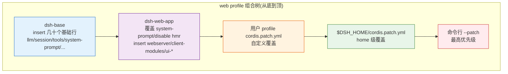

# Profile 概念与组合方式

Profile 是 DSH 的**运行时配置集**:它定义了一个可启动的 dsh 实例由哪些插件组合而成。Profile 把多个 bundle 按顺序叠加,加上用户级 patch,最终形成完整的组合树(composition tree)。

## Profile 是什么

| 概念 | 定义 | 位置 |
|---|---|---|
| **Profile** | 用户运行的组合:有序 bundle 列表 + 用户 patch | `$DSH_HOME/profiles/<name>/` |
| **Profile manifest** | 保存 `dsh.profile.bundles` 有序 bundle 列表 | `$DSH_HOME/profiles/<name>/package.json` |

Profile 由 `dsh plugin` 命令创建和维护。**不要手写用户 profile manifest**——用 `dsh plugin --profile <name> add <bundle>` 来增删 bundle。

## 内置 Profile

DSH 内置两个核心 profile,对应两种运行形态:

### web profile

浏览器界面形态,包含完整 UI 栈。

组合层次(从底到顶):

1. **`dsh-base`**:共享核心(模型适配、工具、会话、持久化、策略、设置/凭据、遥测)。
2. **`dsh-web-app`**:浏览器界面层(web patch + 运行时 glue),插入 webserver、client-modules、所有 `dsh-client-ui-*` 浏览器插件行;禁用 host-plane 的 per-agent 工具行(改由 agent preset 提供)。
3. **用户 profile `cordis.patch.yml`**:用户自定义。
4. **`$DSH_HOME/cordis.patch.yml`**:home 级覆盖。
5. **命令行 `--patch`**:最高优先级。

启动:

```sh
dsh --profile web
# 或从源码
pnpm dsh --profile web
```

特征:

- 含 UI(webserver + 浏览器插件名册 `window.__DSH_BOOT__`)。
- 监听端口(默认 `127.0.0.1:3080`)。
- 支持 HMR(用户 `cordis.patch.yml` 事务性重读)。
- 每会话挂载 agent preset(而非进程级单 agent)。

### headless profile

一次性任务模式,无 Host/Web 层,适合 CI/脚本。

组合层次:

1. **`dsh-base`**(同 web)。
2. **`dsh-headless`**:直接基于 base,提供 coding persona、禁用 HMR、挂载 `code-runtime` worker 与 `headless-runner`;**不挂载** Host、HTTP server、Web runtime 或任何浏览器插件。
3. 用户 patch 层(同 web)。

启动:

```sh
dsh --profile headless "<task>"
# 或从源码
pnpm dsh --profile headless "一个小而可判定的任务"
```

特征:

- **无 UI**:不监听端口,不启动浏览器。
- **单任务**:`headless-runner` 读取 `dsh --profile headless "<task>"` 的位置参数,创建一个 Agent,提交任务为普通用户消息,等待 quiescence,把最后非空 assistant 文本写 stdout,然后退出。
- **退出码**:`turn/end` 完成 → 0;否则 1;terminal `error` reason 写 stderr。
- 适合 CI/脚本/批处理。

## Profile 如何组合多个插件

Profile 的组合树由 patch 层叠加而成。每个 bundle 贡献一个 `cordis.patch.yml` 补丁层,层与层之间按 `id` 覆盖。



### 覆盖语义

- **后层按 `id` 覆盖前层**:`id` 是行身份,稳定不变。
- **`config` 整段替换**:不是深合并,覆盖时要重述所需键。
- **`disabled` 可禁用行**:如 web-app 用 `disabled: true` 禁用 base 的 `tool-bash`/`tool-fs` 等 per-agent 工具行(改由 agent preset 提供)。
- **`insert` 追加新行**:如 web-app `insert` 了 `webserver`、`modules` 等浏览器专属行。

### 外部插件加入 profile

外部 bundle 通过 `dsh plugin --profile <name> add <bundle>` 加入 profile 的 bundles 列表:

```
dsh-base → dsh-web-app → <你的插件 bundle> → 用户 patch → home patch → --patch
```

你的插件的 `cordis.patch.yml` 在 `dsh-web-app` 之后、用户 patch 之前生效,因此可以覆盖 base/web-app 的行,也可被用户 patch 覆盖。

## `--profile` flag 用法

`--profile <name>` 选择启动哪个 profile:

```sh
# 启动 web profile(含 UI)
dsh --profile web

# headless 一次性任务
dsh --profile headless "<task>"

# 自定义 profile(需先用 dsh plugin 创建)
dsh --profile my-scratch --dump-config

# 独立 web profile + 独立端口(不碰运行实例)
dsh --profile my-web --patch <port>
```

### `--profile` 与 plugin 命令配合

```sh
# 向 web profile 添加插件
dsh plugin --profile web add github:owner/repo

# 向自定义 scratch profile 添加(安全验证)
dsh plugin --profile my-scratch add /path/to/dsh-my-plugin

# 转储组合树验证
dsh --profile my-scratch --dump-config
```

## 不同 Profile 的差异

| 维度 | web | headless |
|---|---|---|
| **UI** | 含完整浏览器 UI 栈 | 无 UI |
| **HTTP server** | 监听端口(默认 3080) | 不监听 |
| **浏览器插件** | 挂载所有 `dsh-client-*` | 不挂载任何浏览器插件 |
| **Agent 模型** | 每会话挂载 agent preset | 进程级单 Agent |
| **HMR** | 用户 patch 事务性重读 | HMR 禁用(launcher watch-only fallback 仍保持用户 patch 层 live) |
| **任务模型** | 交互式会话 | 单任务,完成后退出 |
| **适用场景** | 日常开发、交互式对话 | CI/脚本/批处理 |
| **端口冲突** | 需独占端口 | 无端口需求 |
| **code-runtime** | 挂载(web-app insert) | 挂载(headless insert) |

## 验证建议

!!! info "独立 profile 验证"
    验证全程使用**独立 profile/独立端口**,不触碰正在运行的实例。

    - 先用 `dsh plugin --profile <scratch> add <pkg>` 创建非内置 scratch profile。
    - 再执行 `dsh --profile <scratch> --dump-config`,确认 bundle 层、行 id、name、config 和注入顺序。
    - 内置 `web`/`headless` profile 可由 launcher 初始化,不需要手动创建。

## 下一步

- [dsh.bundle 声明规范](dsh-bundle.md) —— bundle 是 profile 的组成单元
- [dsh plugin 命令](plugin-command.md) —— 如何向 profile 添加 bundle
- [最小插件 walkthrough](walkthrough.md) —— 在 scratch profile 中端到端验证
