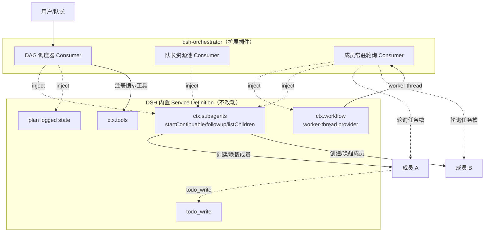

# 方向一：基于 subagent + workflow 的更复杂多智能体编排

## 动机

社区插件 [`dsh-agent-teams`](../plugins/dsh-agent-teams.md) 已经证明「在 DSH 之上做多智能体团队协作」可行：一句自然语言创建团队、拉成员、拆任务、收发消息，并在 Web GUI 右上角展示活动面板。但它的已知弊端恰好划出了可深化的边界：

- **一个队长同时只能带一个团队**（与 Claude Code AgentTeams 一致），无法并行多团队。
- **成员无常驻轮询**：成员仅在收到消息（被唤醒）后才行动；队长离线时消息留在邮箱等待下次操作投递。
- **多进程操作同一团队不保证一致**：团队状态为文件级持久化（`<workspace>/.agent-teams/<teamId>/`），多进程同时操作不保证一致；同一 dsh 进程内已用锁串行化。
- **任务依赖只能声明、不能被运行时强约束为 DAG 调度**：`agent_teams_create_task` 支持 `dependencies` 依赖声明，但调度仍是队长手动驱动。

这些痛点指向同一个拓展机会：在 DSH 内置的 `subagent` + `workflow` + `plan` 能力之上，构建一个**更结构化的多智能体编排层**，把「队长手动驱动」升级为「运行时按 DAG 自动调度」。

## 所需 dsh 能力

本方向复用以下真实存在的 `packages/` 分组（职责描述来自 `packages-layout.md` 与 `AGENTS.md`）：

| 分组 | 实际路径 | 在本方向承担的角色 |
|---|---|---|
| `subagent` | `packages/subagent/` | 子代理能力：Service Definition + provider + 委派 Consumer。提供 `ctx.subagents`，编排层用它创建 / 唤醒 / 查询常驻成员（`startContinuable()` / `followup()` / `listChildren()`） |
| `workflow` | `packages/workflow/` | workflow 能力 + worker-thread provider + tool Consumer。worker-thread provider 可承载常驻成员的轮询 loop，避免占用主 loop |
| `plan` | `packages/plan/` | plan mode 作为 logged state。把 DAG 任务依赖图与执行进度建模为可回放的 logged state，而非游离的磁盘文件 |
| `todo` | `packages/todo/` | `todo_write` 工具。成员级 todo 跟踪，与团队级 DAG 互补 |

!!! info "为何不让编排插件自己写持久化"
    `dsh-agent-teams` 的文件级持久化是已知的多进程一致性来源。本方向应把 DAG 状态交给 `plan`（logged state，可回放）和 `todo`（模型可见），而不是再发明一套磁盘格式——这正是 DSH「Model-visible ⟺ logged」约定的用武之地。

## 预期产出

一个支持以下能力的新型编排插件（暂称 `dsh-orchestrator`）：

1. **DAG 任务依赖调度**：任务声明 `dependencies` 后，运行时自动按拓扑序就绪——依赖未完成时阻塞，全部完成后唤醒下游，而不是等队长手动检查。
2. **成员常驻轮询**：复用 `workflow` 的 worker-thread provider 承载成员轮询 loop，成员不再是「被唤醒才动」，而是常驻监听自己被分配的任务槽。
3. **跨团队协作**：突破「一个队长一个团队」限制，支持队长资源池化与多团队排队调度。
4. **状态可回放**：团队/任务/成员状态走 `plan` 的 logged state，多进程读同一 session log 即可重建拓扑，缓解文件级一致性问题。

### 架构示意



## 潜在风险

!!! warning "状态一致性仍是难点"
    即便把 DAG 状态交给 `plan` 的 logged state，多进程**写**同一 team 状态仍需协调。`dsh-agent-teams` 已知「同一 dsh 进程内已用锁串行化，跨进程不保证」。建议编排插件明确写所有权（单一 owner 进程），或用 `packages/storage` 提供的中心存储做单一写源，避免再走文件级锁。

!!! warning "token 消耗放大"
    成员常驻轮询意味着每个成员都在持续消耗 LLM token。worker-thread provider 把轮询移出主 loop 解决的是「主 loop 阻塞」，不解决「token 成本」。需要为轮询设计退避策略（空槽不调模型、仅在任务就绪时唤醒），并用 `packages/guard` 的 tool-timeout 约束单轮上限。

!!! warning "死锁与循环依赖"
    DAG 调度必须做环检测——`dependencies` 声明出现环时应在 `create_task` 阶段 fail loud（DSH 约定「Misconfiguration fails loud」），而不是在运行时挂死。成员间互发消息也要避免「A 等 B、B 等 A」式的等待环。

!!! warning "成员权限收敛未解决"
    `dsh-agent-teams` 已知成员仍拥有完整工具集（bash/fs/web 等），无最小权限隔离。编排层若放大成员数量，这一风险随之放大。需要为成员 persona 引入最小工具集白名单（如只读 fs、限定 web 域），不能直接复用部署默认的完整工具集。

## 接入点

!!! tip "接入点一：subagent Service Consumer"
    通过 `inject: ['subagents']` 消费 `ctx.subagents`，调用 `startContinuable()` / `followup()` / `listChildren()` 创建、唤醒、查询成员。这是创建成员的唯一正确入口——不要绕过它直接 spawn 进程。

    ```ts
    export const name = 'dsh-orchestrator'
    export const inject = ['subagents', 'tools']
    export function apply(ctx: Context, config: Config): void {
      // 注册 DAG 调度、成员轮询等编排工具到 ctx.tools
    }
    ```

!!! tip "接入点二：workflow tool registration"
    成员常驻轮询 loop 挂在 `workflow` 的 worker-thread provider 上（`inject: ['workflow']`），避免占用主 agent-loop。编排工具通过 `ctx.tools` 注册，与 `dsh-tool-workflow` 同一注册路径。

!!! tip "接入点三：plan / todo 作为状态载体"
    DAG 任务依赖图与执行进度走 `plan` 的 logged state（`inject: ['plan']` 或通过 `ctx.get('plan')` 判断可用性），成员级进度走 `todo_write`。这样新的模型可见输入都对应 session 事件，满足「Model-visible ⟺ logged」。

!!! tip "接入点四：Profile Bundle 分发"
    插件通过 `dsh.bundle.patch` 声明 `cordis.patch.yml` 的 `insert` 行叠加进 profile，与 [walkthrough](../plugin-dev/walkthrough.md) 中的最小插件结构一致。安装用 `dsh plugin --profile <name> add`。

## 与现有插件的差异

| 维度 | dsh-agent-teams | dsh-orchestrator（本方向） |
|---|---|---|
| 调度驱动 | 队长手动检查依赖、手动唤醒成员 | DAG 运行时自动按拓扑序调度 |
| 成员活性 | 被动唤醒（无轮询） | 常驻轮询（worker-thread 承载） |
| 团队并发 | 一个队长一个团队 | 队长资源池化，多团队排队 |
| 状态载体 | 文件级持久化（多进程不保证一致） | plan logged state + storage 中心写源 |

## 相关文档

- [:material-arrow-left: 后续拓展思路总览](index.md) —— 方法论与方向导航
- [:material-account-group: dsh-agent-teams 文档](../plugins/dsh-agent-teams.md) —— 本方向深化的痛点来源
- [:material-tools: 插件机制总览](../plugin-dev/overview.md) —— Service/Consumer 与 `inject` 约定
- [:material-package-variant: packages 布局](../development/packages-layout.md) —— subagent / workflow / plan / todo 分组职责
