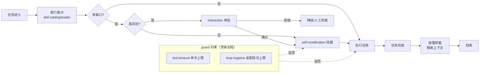

# 方向二：结合 skill + self-modification 的运行时自演化插件

## 动机

DSH 已经具备让 agent「检视并改变自身运行时」的两块拼图，但它们尚未被组合成一个闭环：

- **`packages/extensions/`（self-modification）**：`AGENTS.md` 仓库布局描述名为 `self-modification/`，磁盘实际目录是 `packages/extensions/`。它让 agent 检视 / 挂载自己的插件——即 agent 可以观察当前组合树里有哪些插件，并按需挂载新的。仓库已附 `pnpm run demo:cordis`（the agent modifies its own runtime）作为概念验证。
- **`packages/skill/`**：skill provider 注册表 + 本地实现 + catalog/loader 工具。它提供 `ctx.skills`，agent 可以通过 catalog/loader 工具查询可用的技能清单并按需加载。

这两块拼图合在一起，意味着 agent 能在运行时做到「根据当前任务类型，动态装配所需的能力组合」——而非启动时一次性固化。这正是 DSH「Everything is a plugin」哲学的自然延伸：**插件集合本身也应该是模型可见、可调整的运行时状态**。

目前缺的是把它们缝合成一个受约束、可观测的「任务自适应能力装配」插件：agent 接到任务后先做能力盘点，发现缺口后通过 self-modification 挂载对应 skill / 工具，任务完成后卸载以释放上下文。

## 所需 dsh 能力

本方向复用以下真实存在的 `packages/` 分组：

| 分组 | 实际路径 | 在本方向承担的角色 |
|---|---|---|
| `skill` | `packages/skill/` | skill provider 注册表 + 本地实现 + catalog/loader 工具。提供 `ctx.skills`，agent 通过 catalog/loader 工具查询技能清单、按需加载 |
| `extensions` | `packages/extensions/` | self-modification：agent 检视 / 挂载自己的插件。承载运行时挂载 / 卸载的实际动作 |
| `guard` | `packages/guard/` | loop-hygiene + tool-timeout 插件。防止自演化陷入无限循环或单次装配超时失控 |

可选协同分组：

| 分组 | 实际路径 | 协同作用 |
|---|---|---|
| `interaction` | `packages/interaction/` | approval / permission / ask-user。高风险挂载（如涉及 shell 或网络能力）走人工审批 |
| `preset` | `packages/preset/` | 从预设 `cordis.yml` 文件做每会话 agent 组合。可作为「安全装配模板」的白名单来源 |

## 预期产出

一个「任务自适应能力装配」插件（暂称 `dsh-self-evolve`），其工作闭环为：

1. **能力盘点**：任务进入时，agent 先通过 skill catalog/loader 工具查询当前已挂载的 skills / tools，与任务需求做缺口分析。
2. **按需装配**：发现缺口后，agent 调用 self-modification 能力挂载对应 skill 或插件；可选地走 `interaction` 审批。
3. **执行任务**：装配完成后在新的能力组合下执行任务。
4. **按需卸载**：任务完成后卸载非必需能力，释放上下文窗口，避免 token 膨胀。
5. **全程受 guard 约束**：装配动作受 `guard` 的 tool-timeout 约束，装配轮次受 loop-hygiene 约束，避免无限循环。

### 架构示意

## 潜在风险

!!! warning "无限循环"
    自演化的最大风险是「装配→发现新缺口→再装配」的无限循环。必须用 `packages/guard` 的 loop-hygiene 给装配轮次设硬上限，并用 tool-timeout 给单次挂载动作设超时。装配逻辑应设计为「单调收敛」：每轮装配必须减少缺口数量，否则 fail loud 终止。

!!! warning "自挂载任意插件的安全风险"
    self-modification 能挂载任意插件意味着 agent 可能挂载含 shell / 网络 / 文件写入能力的插件。DSH 约定「Misconfiguration fails loud」，但运行时挂载无法走加载期校验。必须为可挂载集合设白名单——可用 `preset` 的预设 `cordis.yml` 作为允许挂载的模板来源，超出白名单的挂载走 `interaction` 的人工审批。**绝不允许 agent 无约束地挂载未审计的第三方插件**。

!!! warning "可观测性"
    运行时动态挂载 / 卸载让 agent 的能力集合随时间漂移，调试时难以复现「那一刻 agent 到底有哪些能力」。挂载 / 卸载动作必须产生 session 事件（满足「Model-visible ⟺ logged」），让 session log 能完整重建任意时刻的能力组合快照。可考虑借用 `plan` 的 logged state 记录能力装配轨迹。

!!! warning "运行时身份漂移"
    DSH 约定共享运行时（Cordis / React 等）声明为 peerDependencies，「避免复制 runtime identity」。运行时挂载插件若引入了重复的 runtime 副本，会破坏声明合并与类型可见性。自演化插件挂载的子插件必须复用 profile 的 `node_modules`，不能自行 `npm install` 引入重复 runtime。

## 接入点

!!! tip "接入点一：skill Consumer"
    通过 `inject: ['skills']` 消费 `ctx.skills`，调用 catalog/loader 工具查询技能清单、按需加载。这是能力盘点的入口——agent 先知道自己有什么，再决定挂什么。

!!! tip "接入点二：self-modification Service"
    通过 `inject` 消费 `packages/extensions` 提供的 self-modification 能力，执行实际的挂载 / 卸载动作。注意 `extensions` 是磁盘实际目录名（`AGENTS.md` 描述名为 `self-modification/`），引用时以磁盘为准。仓库的 `pnpm run demo:cordis` 是「agent modifies its own runtime」的概念验证，可作为实现参考。

!!! tip "接入点三：guard 约束注入"
    通过 `inject: ['guard']`（或 `ctx.get('guard')` 判断可用性）把装配动作纳入 guard 的 loop-hygiene 与 tool-timeout 约束。即使 guard 未注入，插件自身也应实现装配轮次上限与单次超时，不依赖外部约束存在。

!!! tip "接入点四：interaction 审批（可选）"
    高风险挂载通过 `inject: ['interaction']` 走 `approval` / `permission` / `ask-user`，让人工对超出白名单的挂载放行。这是把「自挂载任意插件」的安全风险降到可接受范围的关键一环。

## 与静态 preset 的区别

| 维度 | `packages/preset`（静态预设） | `dsh-self-evolve`（本方向） |
|---|---|---|
| 装配时机 | 会话启动前从 `cordis.yml` 读取 | 任务执行中动态装配 |
| 装配依据 | 预设文件 | 任务类型 + 能力缺口分析 |
| 可挂载集合 | 文件中显式列出 | 运行时按白名单 + 审批决定 |
| 卸载 | 不卸载（会话级固化） | 任务完成即卸载，释放上下文 |

本方向不替代 `preset`——`preset` 仍是安全装配模板的白名单来源；本方向在 `preset` 划定的安全边界内做运行时动态组合。

## 相关文档

- [:material-arrow-left: 后续拓展思路总览](index.md) —— 方法论与方向导航
- [:material-package-variant: packages 布局](../development/packages-layout.md) —— skill / extensions / guard 分组职责与「描述名 vs 实际目录名」注记
- [:material-tools: 插件机制总览](../plugin-dev/overview.md) —— Service/Consumer 模型与 `inject` 约定
- [:material-walk: 最小插件 walkthrough](../plugin-dev/walkthrough.md) —— 函数插件四要素的最小结构
