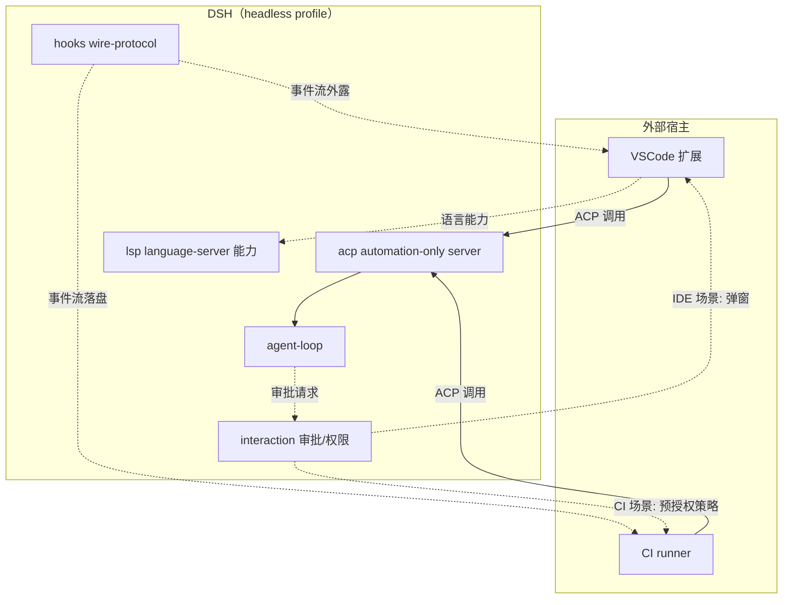

# 方向三：结合 hooks + acp + lsp 的 IDE 集成与自动化流水线接入

## 动机

DSH 目前主要作为「交互式 Web / headless agent」被使用，但 `packages/` 下已经沉淀了三组面向「外部宿主接入」的能力，它们尚未被充分组合成一个 IDE 后端或 CI/CD 流水线 agent 的集成方案：

- **`packages/hooks/`**：Claude Code / Codex hook 桥 + wire-protocol 库。它把 dsh 的事件以线协议形式对外暴露，外部宿主可以监听而不侵入 dsh 内部。
- **`packages/acp/`**：automation-only Agent Client Protocol 服务器。`AGENTS.md` 明确标注为「automation-only」——它专为自动化场景设计，不走交互式 UI 路径。
- **`packages/lsp/`**：language-server 能力。dsh 具备把自身作为类 LSP 服务提供语言能力的接缝。
- **`packages/interaction/`**：approval / interaction 能力、permission、commands、ask-user。它定义了 dsh 如何请求人工审批。

这四块拼图合在一起，恰好覆盖「把 dsh 嵌进 IDE 或 CI 流水线」所需的三个面：**事件外露（hooks）**、**自动化协议（acp）**、**语言能力（lsp）**，以及**审批适配（interaction）**。一个典型的集成目标是：让 VSCode 扩展或 CI runner 把 dsh headless profile 当作后端 agent 调用，而不是再造一套 agent。

## 所需 dsh 能力

本方向复用以下真实存在的 `packages/` 分组：

| 分组 | 实际路径 | 在本方向承担的角色 |
|---|---|---|
| `hooks` | `packages/hooks/` | Claude Code / Codex hook 桥 + wire-protocol 库。把 dsh 的事件流以线协议外露给 IDE / CI 宿主监听 |
| `acp` | `packages/acp/` | automation-only Agent Client Protocol 服务器。IDE / CI 通过 ACP 与 dsh 交互，无需 Web UI |
| `lsp` | `packages/lsp/` | language-server 能力。在 IDE 场景提供类 LSP 的语言能力接缝 |
| `interaction` | `packages/interaction/` | approval / interaction / permission / commands / ask-user。处理跨进程审批与权限请求 |

可选协同分组：

| 分组 | 实际路径 | 协同作用 |
|---|---|---|
| `sdk` | `packages/sdk/` | JSON-RPC 协议、服务器与 TypeScript 客户端。可作为 IDE 扩展侧的客户端实现基础 |
| `examples` | `packages/examples/` | demo bundle（agent-spine + CLI/ACP/JSON-RPC bin）。仓库已附 `pnpm run demo:acp`（ACP automation server）作为集成样例 |

## 预期产出

两类集成方案，可由一个或多个插件 / bundle 提供：

### 方案 A：IDE 后端集成（如 VSCode 扩展）

VSCode 扩展作为宿主，通过 ACP 调用 dsh headless profile，监听 hooks 的 wire-protocol 事件流更新扩展 UI；lsp 接缝在需要时提供语言能力。

### 方案 B：CI/CD 流水线 agent

CI runner（如 GitHub Actions）通过 ACP 把 dsh 作为自动化 agent 调用，无需交互式 UI；hooks 事件流落盘为流水线日志；interaction 的审批在 CI 场景降级为「预授权策略」。

### 架构示意

## 潜在风险

!!! warning "跨进程通信延迟"
    ACP / JSON-RPC / hooks wire-protocol 都跨进程。CI 场景下事件量大时，事件流落盘与传输可能成为瓶颈。需要为事件流设计背压策略，并对高频事件做采样或聚合，避免拖慢 agent-loop。注意 DSH 约定「Waterfall listeners MUST call `next()`」——挂载的监听不能短路链。

!!! warning "审批交互在 CI 场景不适配"
    `interaction` 的 `ask-user` / `approval` 在 IDE 场景可弹窗，但在 CI 场景无人值守。必须为 CI 提供预授权策略（如 `preset` 的预设模板 + 凭证白名单），把「需要审批」降级为「按策略自动放行 / 自动拒绝」，而不是挂起等待永不到来的人工输入。DSH 约定「Misconfiguration fails loud」——策略未覆盖的审批应 fail loud 拒绝，而非静默放行。

!!! warning "lsp 协议适配工作量"
    LSP 是成熟但庞大的协议。把 dsh 的能力适配到 LSP 语义需要明确子集：建议先只对齐 IDE 最常用的几个能力（如诊断、定义跳转），而不是试图完整实现 LSP 全集。`packages/lsp` 提供的是 language-server **能力接缝**，具体协议适配是集成方的工作。

!!! warning "acp automation-only 的边界"
    `AGENTS.md` 明确 `packages/acp` 是「automation-only」。集成方案不能依赖 ACP 提供交互式 UI 能力——需要 UI 的场景应回到 Web profile，或由宿主（IDE 扩展）自己渲染 UI 并通过 ACP 与 dsh 通信，不能指望 ACP 反向驱动 UI。

## 接入点

!!! tip "接入点一：acp Service（automation-only）"
    通过 `inject` 消费 `packages/acp` 提供的 ACP 服务器能力，IDE / CI 宿主经 ACP 与 dsh 交互。仓库的 `pnpm run demo:acp`（ACP automation server，需 `DEEPSEEK_API_KEY`）是直接可参考的样例。`packages/examples` 中的 demo bundle（agent-spine + CLI/ACP/JSON-RPC bin）也可作为集成脚手架。

!!! tip "接入点二：hooks wire-protocol"
    通过 `packages/hooks` 的 wire-protocol 库把 dsh 事件流外露给宿主。宿主监听事件流而非直接侵入 dsh 内部——这符合「插件通过事件协作，而非直接互相调用」的约定。监听器必须通过 `ctx.on()` 注册，返回的 disposer 由框架管理。

!!! tip "接入点三：lsp Service"
    在 IDE 场景通过 `packages/lsp` 提供的 language-server 能力接缝，对齐 IDE 最常用的子集。具体协议适配由集成方负责，先做最小可用子集。

!!! tip "接入点四：interaction 审批适配"
    通过 `inject: ['interaction']` 消费 `ctx` 的 approval / permission / ask-user 能力。IDE 场景走交互式弹窗；CI 场景通过预授权策略把审批降级为自动放行 / 拒绝。这是把 dsh 从「交互式 agent」适配到「无人值守 CI agent」的关键一环。

!!! tip "接入点五：sdk 客户端（宿主侧）"
    宿主侧可用 `packages/sdk` 提供的 JSON-RPC 协议与 TypeScript 客户端作为与 dsh 通信的实现基础，避免自行重写线协议解析。

## IDE 场景 vs CI 场景的差异

| 维度 | IDE 后端集成（方案 A） | CI/CD 流水线 agent（方案 B） |
|---|---|---|
| 宿主 | VSCode 扩展等 | GitHub Actions 等 CI runner |
| 审批 | `interaction` 弹窗交互 | 预授权策略自动放行 / 拒绝 |
| 事件流去向 | hooks wire-protocol → 扩展 UI 更新 | hooks 事件流落盘为流水线日志 |
| UI 来源 | 宿主渲染，或回退 Web profile | 无 UI，走 acp automation-only |
| lsp 必要性 | 较高（IDE 语言能力） | 较低（CI 多为脚本任务） |

## 相关文档

- [:material-arrow-left: 后续拓展思路总览](index.md) —— 方法论与方向导航
- [:material-package-variant: packages 布局](../development/packages-layout.md) —— hooks / acp / lsp / interaction / sdk / examples 分组职责
- [:material-tools: 插件机制总览](../plugin-dev/overview.md) —— Service/Consumer 与事件协作约定
- [:material-console: CLI 与运行模式](../usage/runtime-modes.md) —— headless profile 的运行模式
