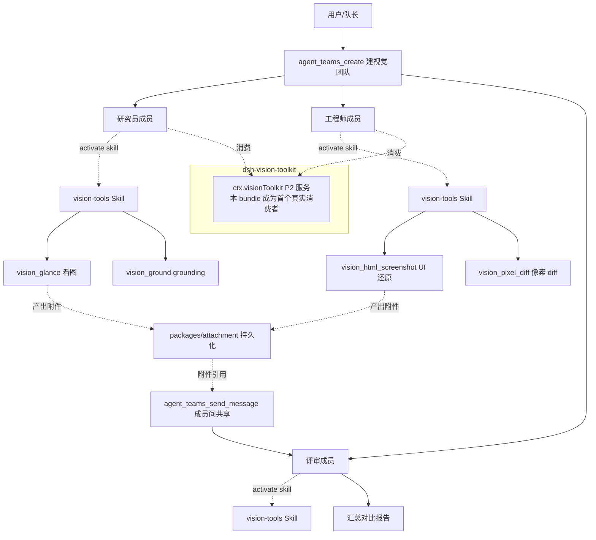

# 方向四：dsh-vision-toolkit + dsh-agent-teams 组合的视觉多智能体

## 动机

两个社区插件各自成熟，但尚未被组合成一个 bundle：

- **`dsh-vision-toolkit`** 提供 10 个视觉工具（`vision_glance` 图片问答 / `vision_ground` grounding / `vision_detect` / `vision_crop` / `vision_trace` / `vision_pixel_diff` / `vision_long_screenshot_ocr` / `vision_extract_foreground` / `vision_dominant_colors` / `vision_html_screenshot`），让纯文本 DSH 代理拥有「眼睛」。
- **`dsh-agent-teams`** 提供多智能体团队协作：创建团队、拉成员、拆任务、成员间收发消息。

两者组合后可实现「多 agent 协同分析截图 / UI 还原 / 视觉回归」——这正是 `dsh-agent-teams` 文档「与其它插件组合的可能性」段已点明、但尚未落地的方向：研究员成员看图、工程师成员做视觉回归、队长汇总对比报告。

更重要的是，`dsh-vision-toolkit` 文档明确写到：**P2 的稳定 `ctx.visionToolkit` 服务刻意不发布，直到有独立插件成为真实消费者**。本方向的组合 bundle 正好可以成为这个「真实消费者」，推动 vision-toolkit 的 P2 稳定服务落地，形成正向循环。

## 所需 dsh 能力

本方向以两个社区插件的 Service/Consumer 为基础，叠加 DSH 内置的附件能力：

| 能力来源 | 路径 / 标识 | 在本方向承担的角色 |
|---|---|---|
| `dsh-agent-teams` 的团队调度 | `agent_teams_*` 工具族 | 创建视觉团队、拉带视觉能力的成员、拆视觉子任务、成员间收发视觉证据 |
| `dsh-vision-toolkit` 的视觉工具 | `vision_*` 工具族（经 `vision-tools` Skill 渐进式暴露） | 成员调用具体视觉能力：看图、grounding、pixel diff、UI 还原 |
| `dsh-vision-toolkit` 的 P2 服务（待发布） | `ctx.visionToolkit`（当前刻意不发布） | 组合 bundle 成为该服务的**首个真实消费者**，推动其发布 |
| `packages/attachment` | `packages/attachment/` | 持久化附件身份、校验、本地 content-addressed 存储。承载成员间共享的视觉证据（截图、crop 产物、HTML 还原） |

可选协同分组：

| 分组 | 实际路径 | 协同作用 |
|---|---|---|
| `credentials` | `packages/credentials/` | vision-toolkit 的视觉 API Key 经 DSH Credentials 注入，组合 bundle 复用同一凭证通道 |
| `skill` | `packages/skill/` | vision-toolkit 的 10 个视觉工具经 `vision-tools` Skill 渐进式暴露，成员需先激活 skill 才挂载视觉工具 |

## 预期产出

一个组合 Profile Bundle（暂称 `dsh-vision-team`），其工作流为：

1. **建视觉团队**：队长（用户）通过 `agent_teams_create` 创建团队，按视觉任务角色拉成员（研究员 / 工程师 / 评审）。
2. **成员激活视觉能力**：每个视觉成员先调 `vision_toolkit_activate` 激活 `vision-tools` Skill，挂载 10 个视觉工具——激活仅影响该 Agent，持续到 Agent 销毁。
3. **分配视觉子任务**：研究员成员用 `vision_glance` / `vision_ground` 看图分析；工程师成员用 `vision_html_screenshot` + `vision_pixel_diff` 做参考图-实现图量化验收。
4. **视觉证据共享**：crop / trace / OCR / HTML 还原等产出作为附件经 `packages/attachment` 持久化，成员间通过 `agent_teams_send_message` 互传附件引用，而非互传原始图片 token。
5. **队长汇总**：队长收集各成员产出，汇总对比报告。

### 架构示意

## 潜在风险

!!! warning "视觉 API 成本"
    `vision_glance` / `vision_ground` / `vision_detect` 及非 split-only 的长截图 OCR 需 OpenAI 兼容视觉端点 + DSH Credential，是付费调用。多智能体放大调用次数——每个成员都可能独立调视觉 API。需要为团队设并发与调用次数预算（vision-toolkit 的 `concurrency` 配置项上限是 1-16），并对重复视觉查询做去重。vision-toolkit 已知「仅保留最近一次 `vision_glance` 结果，无跨会话视觉缓存」，可在外部加一层按图像哈希 + 查询哈希的缓存。

!!! warning "成员间视觉上下文共享"
    成员间直接互传原始图片会导致 token 膨胀（图片 token 远高于文本）。必须用 `packages/attachment` 把视觉产出持久化为附件，成员间只互传附件引用——这与 vision-toolkit 已知的「图片走 DSH 原生模型附件通道会被纯文本模型拒绝，需用 Paste Input 把文件复制进会话工作区并以路径表示」一致。组合 bundle 应统一走「附件引用 + 路径表示」，避免图片直接进模型上下文。

!!! warning "token 膨胀"
    10 个视觉工具的 schema 经 Skill 渐进式暴露，但每个视觉成员激活后仍占用工具描述 token。多成员 × 多视觉工具会快速吃满上下文。建议按角色限定可激活的视觉工具子集（研究员只激活 glance/ground，工程师只激活 html_screenshot/pixel_diff），而非全员激活全集。

!!! warning "继承 agent-teams 的已知限制"
    组合 bundle 继承 `dsh-agent-teams` 的全部弊端：一个队长一个团队、成员无常驻轮询、文件级持久化的多进程一致性问题、成员拥有完整工具集无最小权限隔离。这些限制不会因叠加视觉能力而消失——详见 [dsh-agent-teams 弊端文档](../plugins/dsh-agent-teams.md)。如需突破，应结合 [方向一](direction-1-orchestration.md) 的编排能力一并解决。

## 接入点

!!! tip "接入点一：vision-toolkit 的 vision service Consumer"
    组合 bundle 通过消费 `dsh-vision-toolkit` 提供的视觉能力（当前是 `vision_*` 工具族经 `vision-tools` Skill 暴露；P2 发布后是 `ctx.visionToolkit` 服务）让成员获得视觉能力。本 bundle 正是 vision-toolkit 文档所述「等待的真实消费者」——率先消费可推动 P2 稳定服务落地。

!!! tip "接入点二：agent-teams 的团队调度"
    复用 `dsh-agent-teams` 的 `agent_teams_*` 工具族做团队创建、成员拉取、任务拆分、成员间消息直达。这是 `ctx.subagents`（`startContinuable` / `followup` / `listChildren`）在多智能体场景的上层封装——组合 bundle 不绕过它直接 spawn 成员。

!!! tip "接入点三：packages/attachment 做视觉证据共享"
    通过 `inject: ['attachment']`（或 `ctx.get('attachment')` 判断可用性）把视觉产出（crop / trace / HTML 还原）持久化为 content-addressed 附件，成员间互传附件引用而非原始图片。这既控制 token，又满足「图片走路径表示、不直接进纯文本模型上下文」的约束。

!!! tip "接入点四：Profile Bundle 组合分发"
    本方向是典型的「组合 bundle」——通过 `dsh.bundle.patch` 声明 `cordis.patch.yml`，把 `dsh-vision-toolkit` 与 `dsh-agent-teams` 的组合行叠加为一个 `dsh-vision-team` profile，外加协调逻辑插件。安装用 `dsh plugin --profile vision-team add`。这与 [walkthrough](../plugin-dev/walkthrough.md) 的最小插件结构一致，只是 `insert` 多行叠加。

## 与单插件使用的差异

| 维度 | 单独用 vision-toolkit | 单独用 agent-teams | 组合 bundle（本方向） |
|---|---|---|---|
| 视觉能力 | 单 agent 调用视觉工具 | 无视觉能力 | 多成员协同调视觉工具 |
| 任务规模 | 单一视觉任务 | 多智能体但无视觉 | 多视觉子任务并行（看图 + 还原 + 回归） |
| 证据共享 | 无 | 邮箱传文本 | 附件引用共享视觉证据 |
| 验收 | 人工看结果 | 队长汇总 | 评审成员 + pixel_diff 量化验收闭环 |

## 与其它方向的关系

- 本方向继承 `dsh-agent-teams` 的调度限制；若要突破「一个队长一个团队」「成员被动唤醒」，应叠加 [方向一](direction-1-orchestration.md) 的编排能力。
- 本方向的视觉成员若需按任务动态激活视觉 Skill，可叠加 [方向二](direction-2-self-evolution.md) 的自演化能力，让成员按任务类型决定激活哪些视觉工具子集。

## 相关文档

- [:material-arrow-left: 后续拓展思路总览](index.md) —— 方法论与方向导航
- [:material-eye: dsh-vision-toolkit 文档](../plugins/dsh-vision-toolkit.md) —— 视觉工具清单与 P2 服务等待消费者的说明
- [:material-account-group: dsh-agent-teams 文档](../plugins/dsh-agent-teams.md) —— 团队调度工具族与已知限制
- [:material-package-variant: packages 布局](../development/packages-layout.md) —— `packages/attachment` 的附件能力职责
