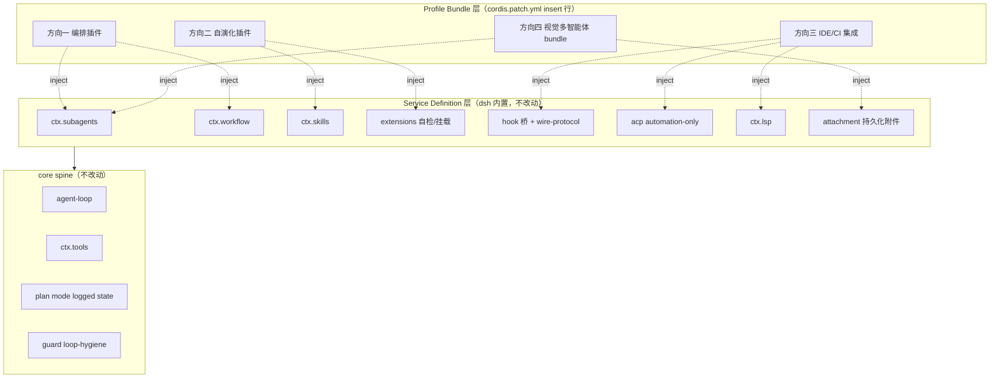

# 后续拓展思路

DeepSeek Harness（以下简称 DSH）目前处于 **developer preview** 阶段：`packages/` 下已沉淀出完整的能力分组（subagent / workflow / skill / self-modification / hooks / acp / lsp / plan / preset / guard / interaction 等），插件体系（Service / Consumer / Profile Bundle）跑通，社区生态也已起步——`dsh-agent-teams` 多智能体、`dsh-vision-toolkit` 视觉、`DSH-better-sidebar` 侧边栏等插件证明组合模型可行。

但生态远未饱和：Cordis「能力 seam 由 Service Definition / Provider / Consumer 三角色组成」的组合模型，意味着**任何新行为都应落在文档化的扩展点上，而不是改动 loop**。这为社区开发者留下了广阔的二次开发空间。本章节为社区指明可落地的拓展方向。

## 为什么需要拓展

- **DSH 主线仍在预览期，能力组合未被穷举**：`AGENTS.md` 明确「新行为走插件扩展点，改动 `agent-loop` 需更新 docs/architecture.md」。大量已就位的 packages 分组尚未被社区插件充分组合。
- **Cordis 组合模型提供天然扩展面**：每个能力接缝是三角色完整体，扩展插件依赖 Service Definition、永不依赖具体 provider——这意味着新插件可在不触碰 provider 实现的前提下挂载能力。
- **社区插件已暴露出可深化的痛点**：例如 `dsh-agent-teams` 受限于「一个队长一个团队」「成员被动唤醒」「文件级持久化的多进程一致性问题」，这些恰好是下一层拓展的切入点。

## 拓展方向导航

| 方向 | 主题 | 复用的核心 packages 分组 | 预期产出 |
|---|---|---|---|
| [方向一：多智能体编排](direction-1-orchestration.md) | 基于 subagent + workflow 的更复杂多智能体编排 | `subagent` / `workflow` / `plan` / `todo` | 支持 DAG 任务依赖、成员常驻轮询、跨团队协作的编排插件 |
| [方向二：运行时自演化](direction-2-self-evolution.md) | 结合 skill + self-modification 的任务自适应能力装配 | `skill` / `extensions`(self-modification) / `guard` | agent 根据任务类型动态加载/卸载 skills 与插件 |
| [方向三：IDE 与流水线集成](direction-3-ide-integration.md) | 结合 hooks + acp + lsp 的 IDE 后端与 CI/CD 接入 | `hooks` / `acp` / `lsp` / `interaction` | 将 dsh 作为 IDE 后端或 CI 流水线 agent 的集成方案 |
| [方向四：视觉多智能体](direction-4-vision-multiagent.md) | dsh-vision-toolkit + dsh-agent-teams 的组合 | `attachment` + 两社区插件 Service/Consumer | 调度带视觉能力的成员团队的组合 bundle |

## 方法论：每个方向必须找到可执行的接入点

本章节不是空中楼阁式的设想。每个拓展方向都遵循同一条约束：

!!! tip "接入点必须可执行"
    每个方向必须在 DSH 插件体系内找到**具体的接入点**——要么是 Service / Consumer 接缝（通过 `inject` 声明依赖、消费 `ctx.<service>`），要么是 Profile Bundle（`dsh.bundle.patch` 声明叠加组合行）。引用的 `packages/` 分组必须是真实存在的，描述的 `ctx` key 必须能在当前 checkout 解析。

    按 [插件机制总览](../plugin-dev/overview.md) 的约定：

    - **Service Definition → Provider → Consumer** 三角色完整不可拆；扩展插件依赖 Definition，永不依赖具体 provider。
    - 函数插件四要素 `name` / `inject` / `Config` / `apply` 是最小挂载单位。
    - `inject` 只等**服务已提供**，不等 provider 注册；可选 service 用 `ctx.get()` 判断。
    - 所有长生命周期资源必须通过 `ctx.effect()` / `ctx.on()` 注册，返回的 disposer 由框架管理。

## 拓展方向的通用分层

上图说明：四个拓展方向都通过 `inject` 声明依赖，挂载到 DSH 内置的 Service Definition 层，最终汇入 core spine。**拓展插件不改动 core，也不绑定具体 provider**——这是 DSH 组合模型的根本约束。

## 阅读顺序建议

1. 先读本页「方法论」，理解接入点的判定标准。
2. 按兴趣选方向：关心多智能体协作从 [方向一](direction-1-orchestration.md) 入手；关心 agent 自适应从 [方向二](direction-2-self-evolution.md) 入手；关心把 dsh 嵌进 IDE/CI 从 [方向三](direction-3-ide-integration.md) 入手；已有 vision-toolkit + agent-teams 想做组合从 [方向四](direction-4-vision-multiagent.md) 入手。
3. 每个方向文档末尾有「接入点」与「潜在风险」两段，落地前必读。

## 相关文档

- [:material-tools: 插件机制总览](../plugin-dev/overview.md) —— Service/Consumer 模型与 `inject` 约定
- [:material-package-variant: packages 布局](../development/packages-layout.md) —— 各分组职责的真实来源
- [:material-account-group: 社区插件现状](../plugins/index.md) —— 已有插件与可深化痛点
- [:material-walk: 最小插件 walkthrough](../plugin-dev/walkthrough.md) —— 从零编写插件的最小步骤
